# AI Stock Trading Platform (AI 智能投研平台)

[](https://www.python.org/downloads/release/python-3100/)
[](https://opensource.org/licenses/MIT)
[](http://makeapullrequest.com)

[English](README.md) | [中文](README_CN.md)


> [!WARNING]
> **Disclaimer**: 本项目代码完全由AI生成，暂时只跑了流程，不保证数据准确性和可靠性
> **Disclaimer**: This software is for **educational and research purposes only**. It comes with no guarantees or warranties. Using this software for live financial trading involves significant risk. The authors are not responsible for any financial losses incurred.

---

## 🇬🇧 Project Introduction
**AI Stock Trading Platform** is a comprehensive intelligent investment research system powered by multi-agent collaboration. It integrates market news analysis, fundamental screening, technical analysis, and financial report interpretation to provide investors with real-time, data-driven investment insights.

### Key Features
- **🤖 Multi-Agent Collaboration**: Specialized agents for News, Technical, and Fundamental analysis working together via a central coordinator.
- **📚 Deep Research**: Automated financial report (PDF) parsing with "Chain of Thought" reasoning and source tracing.
- **💹 Real-time Data**: Seamless integration with AkShare and YFinance for global market coverage (US/HK/A-share).
- **🕸️ Macro Insight**: Real-time macroeconomic data analysis (Fed rates, inflation) ensuring big-picture awareness.


---

## 🏗 System Architecture

The system follows a modern micro-service-like architecture with a Next.js frontend and a FastAPI backend orchestrating intelligent agents.

### Architecture Diagram

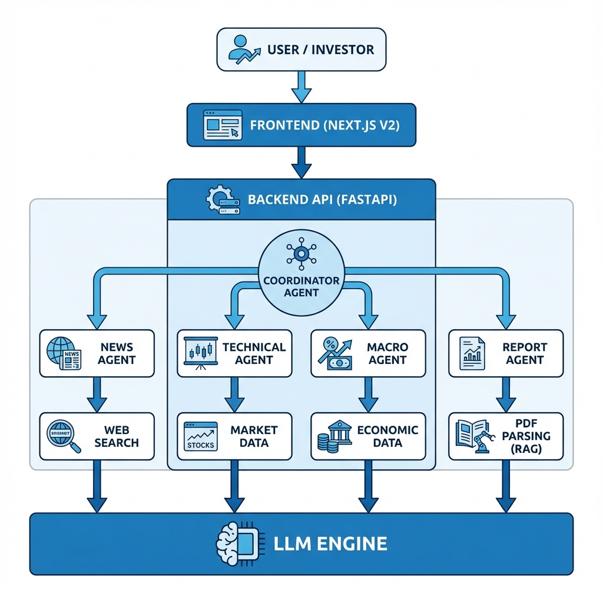

<details>
<summary>Mermaid Source (Click to expand)</summary>

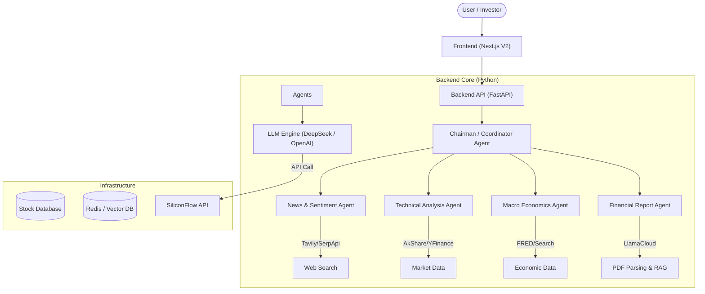
</details>

### Directory Structure (目录结构)

| Path | Description |
| :--- | :--- |
| **`frontendV2/`** | Modern web interface (Next.js, React, TailwindCSS). Handles real-time streaming and data visualization. |
| **`backend/`** | Main backend codebase. |
| &nbsp;&nbsp;`app/agents/` | Core Agents logic (Chairman, News, Technical, Macro). |
| &nbsp;&nbsp;`infrastructure/` | Infrastructure layer (Market Data adapters, Database, LLM integrations). |
| &nbsp;&nbsp;`entrypoints/` | FastAPI server entry points and routers. |
| **`skills/`** | Shared modular capabilities (PDF Parsing, Market Data, Web Search). |
| **`memory_system/`** | Dedicated agent context management and long-term memory system (Redis/Vector DB). |

---

## 🧩 Features

### 1. News Analysis (消息面分析)
Utilizes a hybrid search strategy to capture real-time market dynamics. It aggregates mainstream news via Search APIs while employing LLM-controlled headless browsers (**Browser-use/Playwright**) to mine retail sentiment from social forums.
*(Note: Social media scraping is currently being optimized due to strict anti-bot measures)*

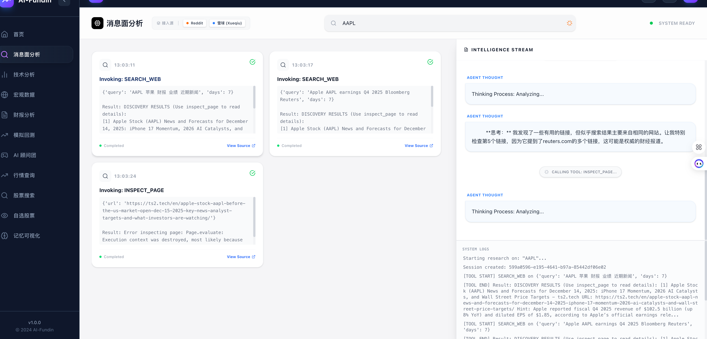
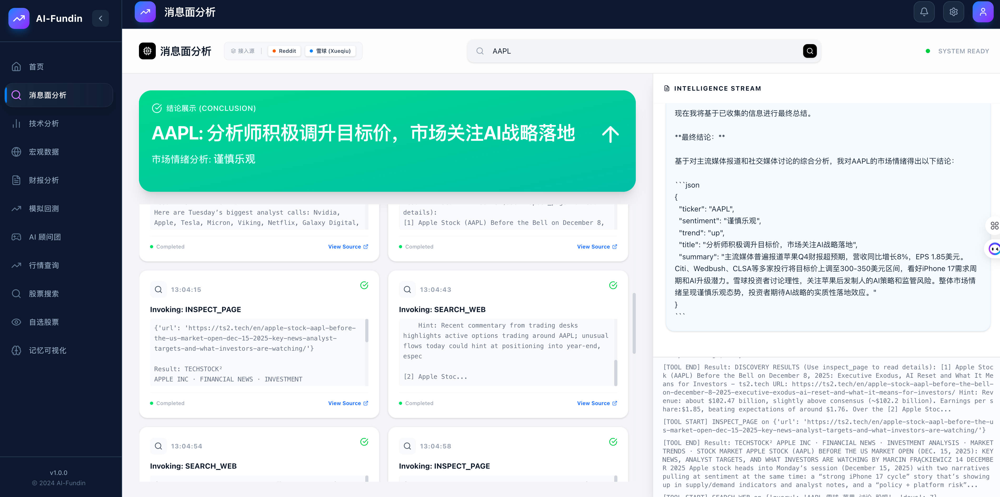

### 2. Technical Analysis (技术面分析)
Integrates Dow Theory, Elliott Wave Theory, and Wyckoff Method with quantitative indicators (RSI, MACD, Bollinger Bands, KDJ) to provide high-confidence trend predictions and trading signals.

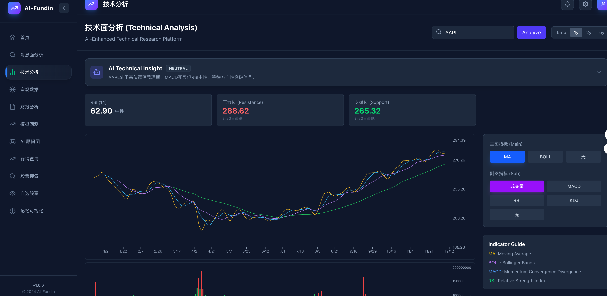
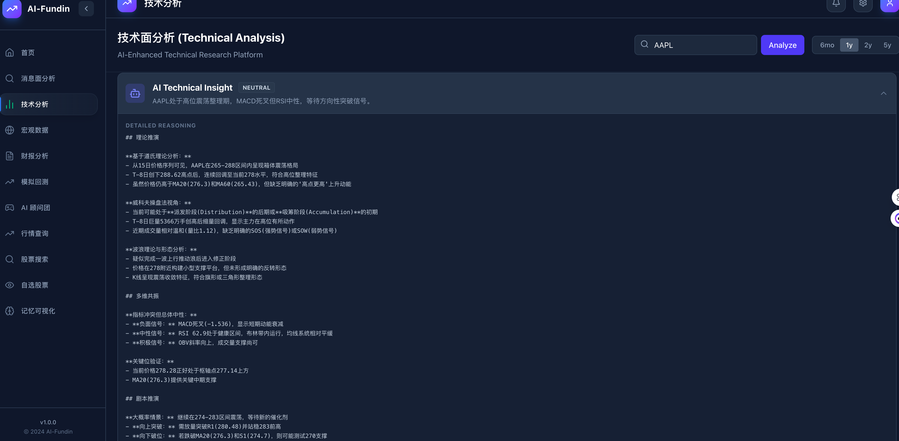

### 3. Macro Data Analysis (宏观数据分析)
Real-time retrieval and analysis of core domestic and international macroeconomic data (e.g., Fed interest rates, CPI/PPI, GDP growth) to assess asset cycles and macro trends.

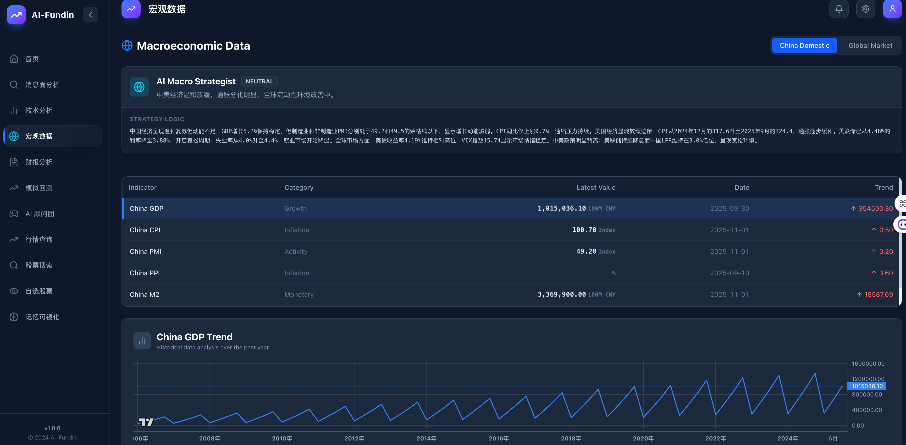
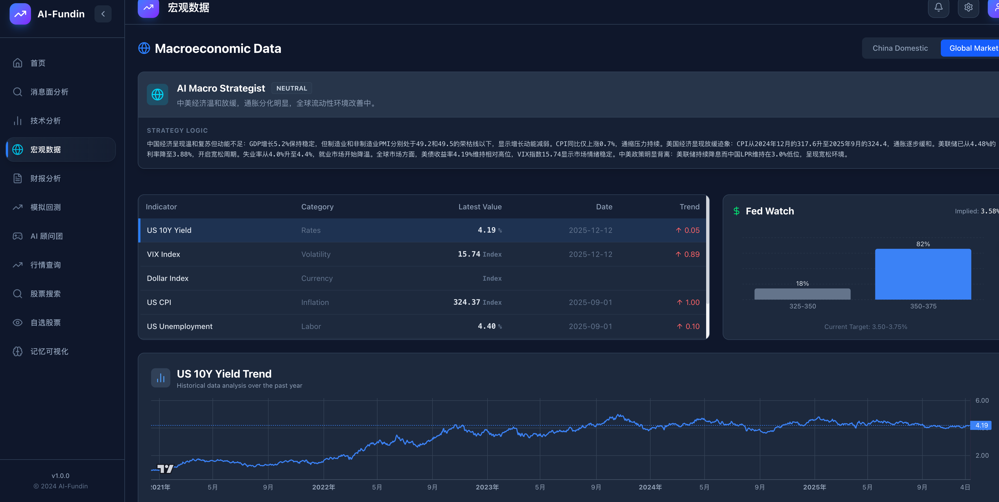

### 4. Financial Report Analysis (财报分析)
Intelligently fetches and parses PDF financial reports (US/HK/A-share), extracting key metrics (Revenue, Net Profit, Cash Flow) using RAG technology for precise source grounding.
*(Note: LLM deep interpretation capabilities are currently under iteration)*

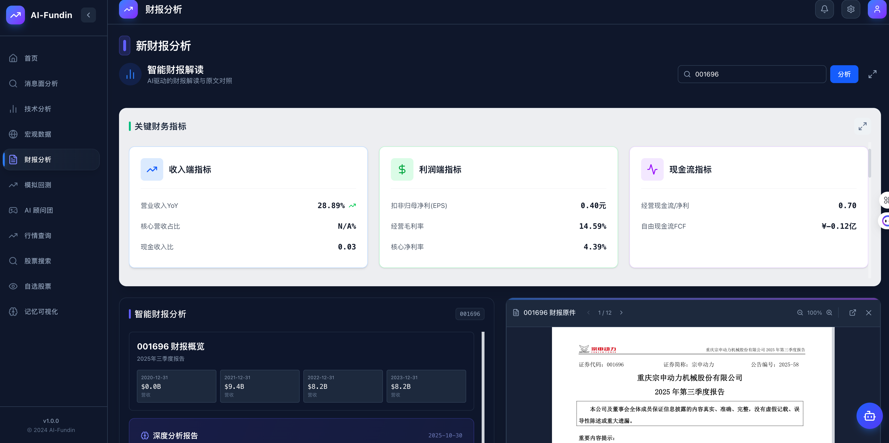
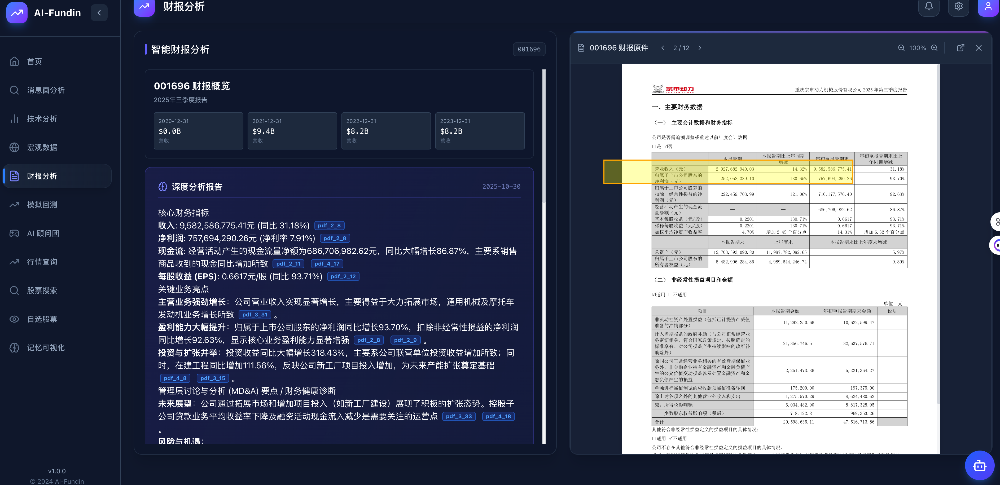

### 5. Paper Trading (模拟盘)
AI agents automatically execute simulated trades, tracking strategy performance in real-time to validate the effectiveness and robustness of investment strategies.

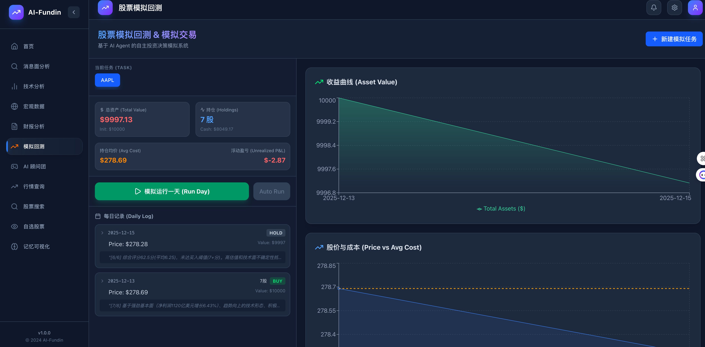

### 6. AI Council (AI 顾问团)
Simulates a "One-Person Company" decision-making structure. A council of AI roles (CEO, CTO, Chief Analyst) discusses user inquiries from multiple perspectives to provide comprehensive answers.


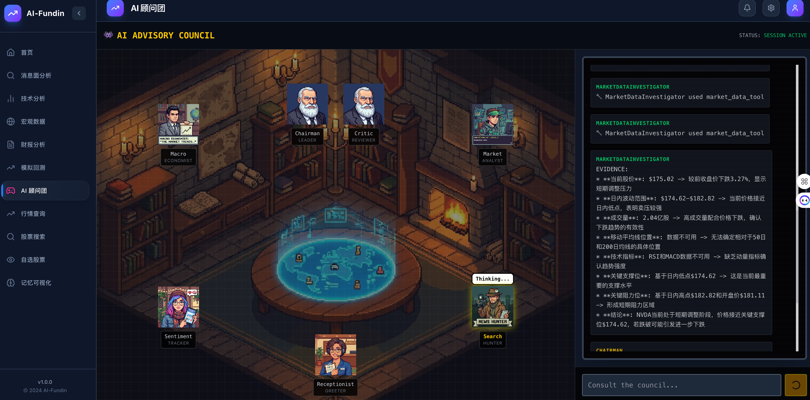
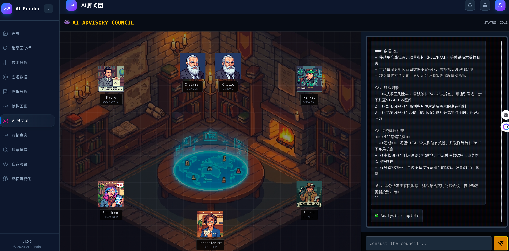

---

## 🚀 Quick Start

### Prerequisites
- Python 3.10+
- Node.js 18+
- [Git](https://git-scm.com/)

### Installation

1. **Clone the repository**
   ```bash
   git clone https://github.com/your-username/stock-trading-platform.git
   cd stock-trading-platform
   ```

2. **Backend Setup**
   ```bash
   # Create virtual environment
   python -m venv .venv
   source .venv/bin/activate  # Windows: .venv\Scripts\activate
   
   # Install dependencies
   pip install -r requirements.txt
   ```

3. **Frontend Setup**
   ```bash
   cd frontendV2
   npm install
   ```

4. **Configuration**
   Copy the example config and fill in your API keys:
   ```bash
   cp .config.yaml.example .config.yaml
   ```
   
   **Required API Keys**:
   - `tavily`: For AI search. ([Get Key](https://tavily.com))
   - `llama_cloud`: For high-quality PDF parsing. ([Get Key](https://cloud.llamaindex.ai))
   - `siliconflow` or `openai`: Main LLM provider.
   - `fred_api_key`: For macroeconomic data.

5. **Run the System**
   
   Start Backend:
   ```bash
   # In root directory
   python -m backend.entrypoints.api.server
   ```
   
   Start Frontend:
   ```bash
   # In frontendV2 directory
   npm run dev
   ```
   Access the app at `http://localhost:3000`.

---

## 🤝 Contributing

Contributions are what make the open source community such an amazing place to learn, inspire, and create. Any contributions you make are **greatly appreciated**.

1. Fork the Project
2. Create your Feature Branch (`git checkout -b feat/AmazingFeature`)
3. Commit your Changes (`git commit -m 'Add some AmazingFeature'`)
4. Push to the Branch (`git push origin feat/AmazingFeature`)
5. Open a Pull Request

## 📄 License

Distributed under the MIT License. See `LICENSE` for more information.

## 📅 Roadmap
