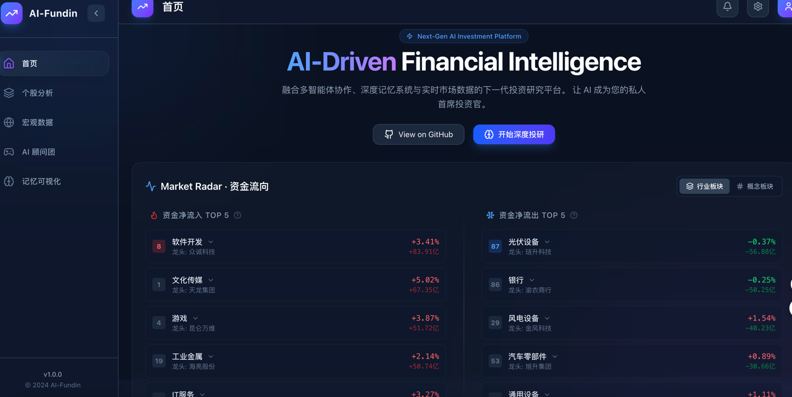
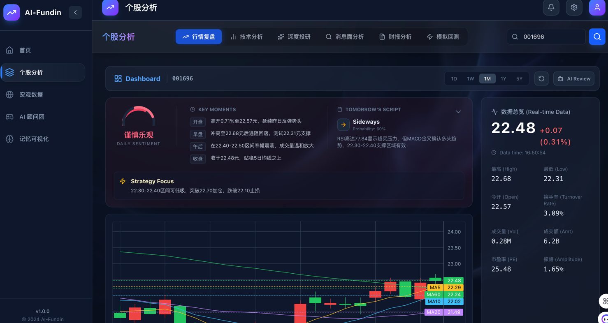
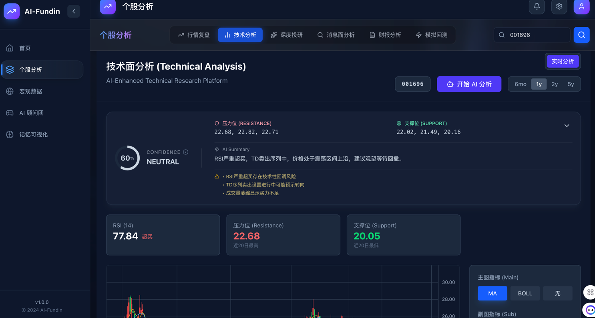
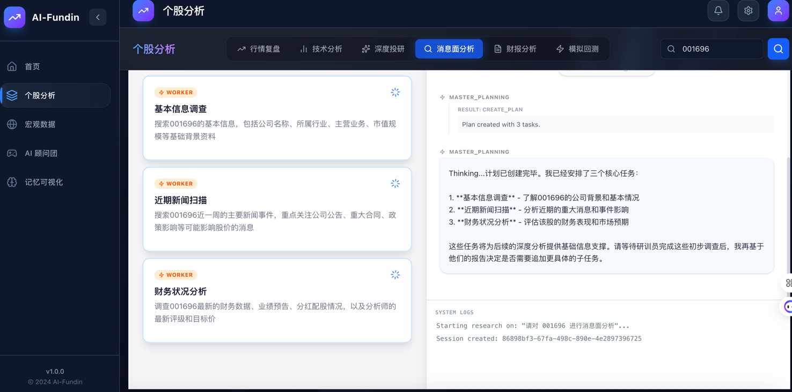
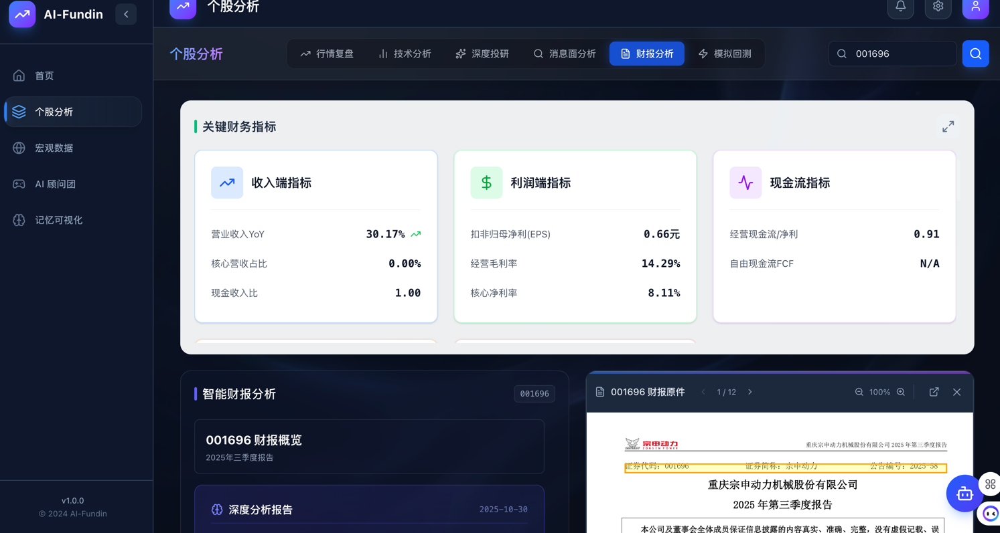
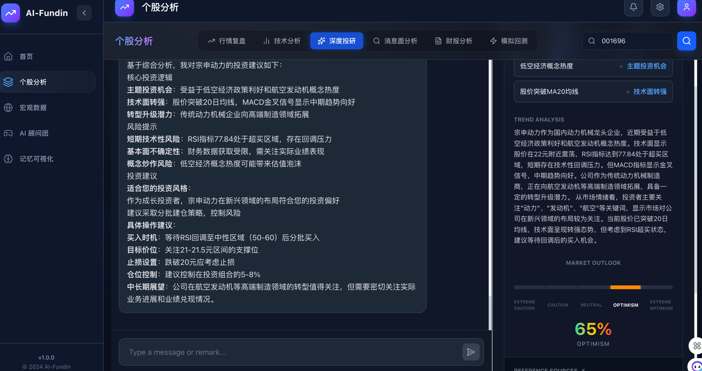
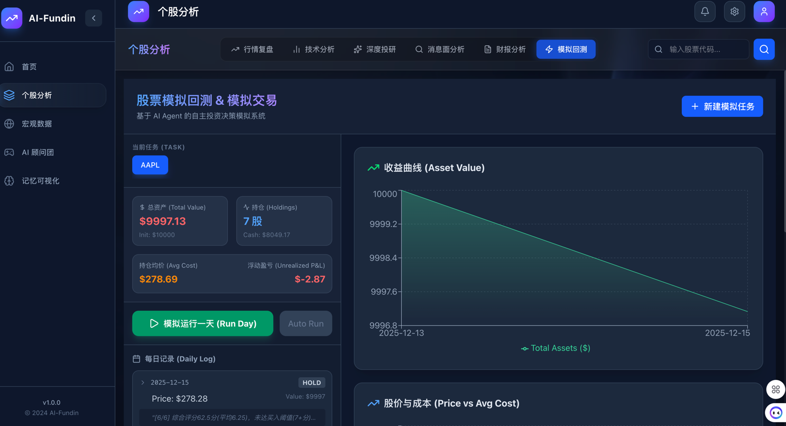
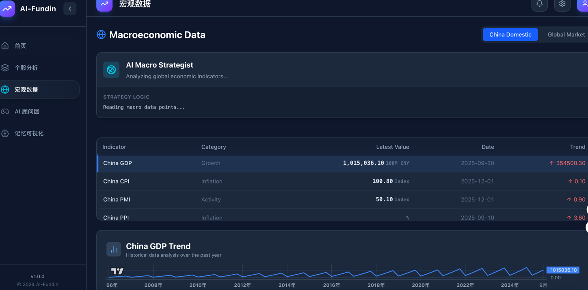
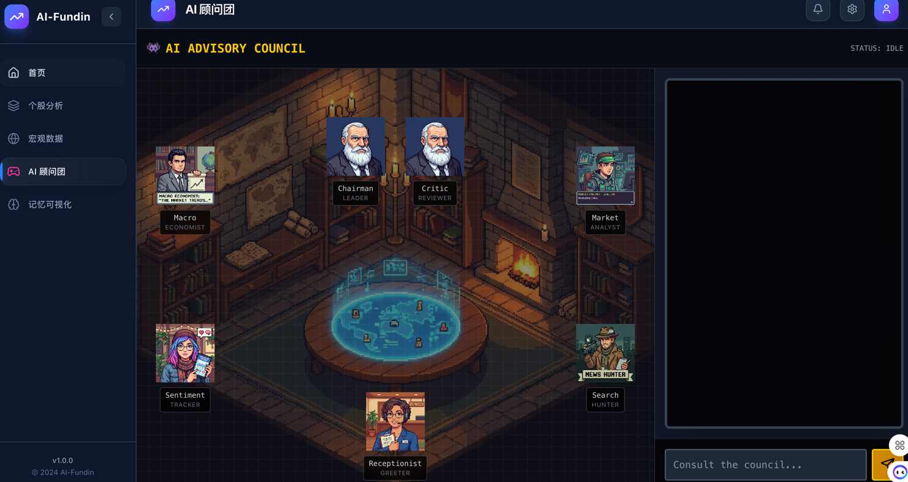
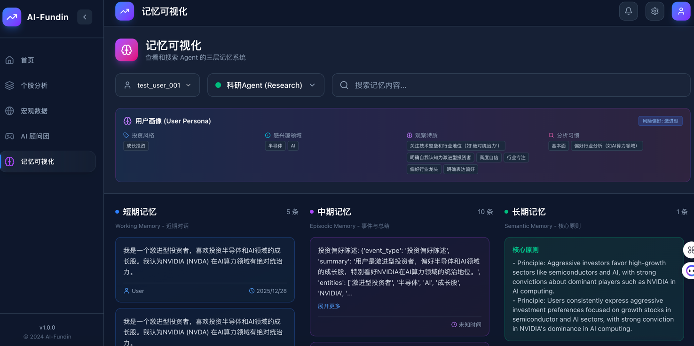

# AI Stock Trading Platform

[](https://www.python.org/downloads/release/python-3100/)
[](https://opensource.org/licenses/MIT)

[English](README.md) | [中文](README_CN.md)

> [!WARNING]
> **Disclaimer**: This project is an **AI Vibe Coding** experiment aimed at exploring whether AI can independently complete the writing and maintenance of a large-scale project. **All code is generated by AI**.
>
> **Disclaimer**: This software is for **educational and research purposes only**. Some data may be inaccurate or delayed. No guarantees are provided. Using this software for live trading involves significant risk, and the authors are not responsible for any financial losses.
>
> **Note**: Some data sources (e.g., Yahoo Finance) may require a **VPN or Proxy** to access, especially if you are in Mainland China. Please ensure proper network configuration to avoid data fetching failures.

---

## 💡 Background

The core purpose of this project is to conduct an **AI Full-Stack Development Practice**. We are trying to answer the question: **Can current AI technology autonomously complete the writing and maintenance of a large-scale software system involving frontend, backend, data processing, and complex logic with minimal human intervention?**

Therefore, the majority of the work in this project, from architecture design and code writing to documentation, has been completed by AI.

---

## 🏗 System Architecture

The project is divided into three core parts, with the backend integrating various Agent paradigms (ReAct, Multi-Agent Debate, Master-Sub Agent) and frameworks (Google ADK, LangChain):

1.  **Frontend**: Responsible for data display and user interaction, providing a modern visualization interface.
2.  **Backend**: Responsible for data fetching, processing, and core Agent scheduling and orchestration.
3.  **Memory System**: An independent cognitive storage layer composed of short-term, medium-term, and long-term memory, designed to allow AI to form a long-term investment style and possess self-reflection capabilities.

---

## 🧩 Features

### 1. Home
The entry point of the project, providing intuitive market data display, including key information such as A-share market indices and sector fund flows, helping users quickly grasp the overall market sentiment.



### 2. Stock Analysis
A comprehensive deep scan of a single stock, including the following sub-modules:

*   **Market Review**: Displays basic stock information, where AI analyzes today's price movements and provides operational suggestions.
    

*   **Technical Analysis**: Combining technical indicators like MACD, KDJ, BOLL, and classic trading theories like Dow Theory, AI provides in-depth interpretation of the market and predicts future trends.
    

*   **News Analysis**: Searches mainstream media news across the web and delves into social media platforms like Reddit and Xueqiu to mine retail discussions, conducting sentiment and public opinion analysis through AI.
    

*   **Financial Report**: Automatically fetches and parses financial report data to conduct fundamental diagnosis and assess the company's financial health.
    

*   **Deep Research**: Synthesizes the analysis results from all the above tools to provide a comprehensive score and deep judgment on the stock.
    

*   **Simulation**: (Experimental Feature) Shows historical backtesting based on AI strategies.
    

### 3. Macro Data
Real-time fetching of domestic and international core macroeconomic data (such as CPI, PPI, GDP, VIX, etc.), based on which AI analyzes the macroeconomic situation to assist in judging the direction of major asset allocation.



### 4. AI Council
Referencing the concept of a "One-Person Company," an advisory team composed of multiple AI roles (such as CEO, CTO, Chief Analyst, etc.) is built. Users ask questions, and multiple AIs perform their respective duties in a roundtable discussion, finally providing a comprehensive conclusion.



### 5. Memory Visualization
This is an exploratory highlight of the project. We expect AI not to be just a stateless Q&A machine but to form a long-term investment style.
*   **Reflection & Correction**: AI can review and reflect on historical decisions, correcting its own investment logic.
*   **Triple-Layer Memory**: Implemented a memory system consisting of Working Memory, Episodic Memory, and Semantic Memory.
*(Note: Currently only a few Agents are connected to this system)*



---

## 🛠️ Technical Exploration

This project has conducted extensive technical exploration in the development of backend Agents:

*   **Agent Paradigm Diversity**:
    *   **Single Agent ReAct**: Used for simple tool-calling tasks.
    *   **Multi-Agent Debate**: Used for multi-perspective discussion of complex issues (e.g., the Council).
    *   **Master-Sub Agent**: Used for task decomposition and distribution (e.g., Deep Research).
*   **Framework Attempts**:
    *   **Google ADK (Agent Development Kit)**: Used to build standardized Agents.
    *   **LangChain**: Used for early prototype validation and partial toolchains.
    *   **Custom EventBus**: Implements decoupling and communication between modules.

---

## 🚀 Quick Start

### 1. Start Backend & Agent Services

```bash
# Install dependencies
pip install -r requirements.txt

# Configure environment (copy .config.yaml.example and fill in API Keys)
cp .config.yaml.example .config.yaml

# Start core API service
python -m backend.entrypoints.api.server
```

### 2. Start Memory System (Optional)

```bash
cd memory_system
pip install -r requirements.txt
python -m api.server
```

### 3. Start Frontend

```bash
cd frontendV2
npm install
npm run dev
# Access at http://localhost:3000
```

---

## 🤝 Contribution

You are welcome to Fork this project and submit PRs. Since the code is primarily generated by AI, it may contain some non-typical coding habits. Optimization by human developers is welcome!

## 📄 License

MIT License
