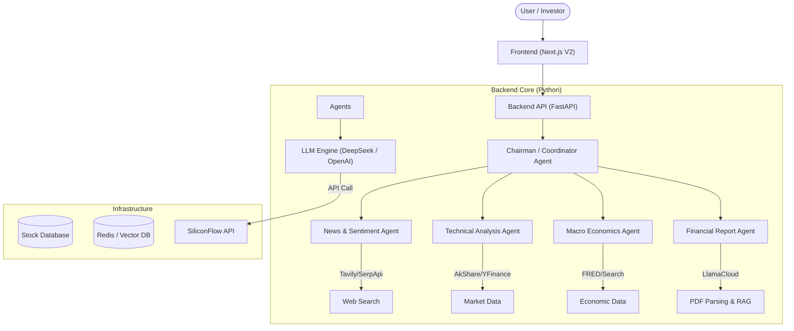

# AI Stock Trading Platform (AI 智能投研平台)

[](https://www.python.org/downloads/release/python-3100/)
[](https://opensource.org/licenses/MIT)
[](http://makeapullrequest.com)

[English](README.md) | [中文](README_CN.md)


> [!WARNING]
> **Disclaimer**: 本项目代码完全由AI生成，暂时只跑了流程，不保证数据准确性和可靠性
> **免责声明**: 本软件仅供**教育和研究使用**。不提供任何保证。使用本软件进行实盘交易涉及巨大风险，作者不对任何资金损失负责。

---

## 🇨🇳 项目介绍
**AI Stock Trading Platform** 是一个基于多智能体协作（Multi-Agent）的全方位 AI 投研平台。它集成了消息面分析、基本均面筛选、技术面诊断以及财报深度解读等功能，致力于为投资者提供实时、深度的投资决策支持。

### 核心亮点
- **🤖 多智能体协同**: 消息、技术、基本面等专职 Agent 协同工作，产出综合分析报告。
- **📚 深度研报分析**: 基于 RAG 技术实现研报 PDF 的自动解析与关键信息提取，支持原文溯源 (Source-Grounding)。
- **💹 全市场覆盖**: 支持美股、港股、A 股实时行情与历史数据分析。
- **🕸️ 宏观洞察**: 实时监控宏观经济数据（如美联储利率、通胀数据），把握大周期趋势。

---

## 🏗 系统架构

本系统采用类似微服务的现代架构，以前端 Next.js 和后端 FastAPI 编排智能体。

### 架构图


<details>
<summary>Mermaid 源码 (点击展开)</summary>


</details>

### 目录结构

| 路径 | 描述 |
| :--- | :--- |
| **`frontendV2/`** | 现代 Web 界面 (Next.js, React, TailwindCSS)。处理实时流式传输和数据可视化。 |
| **`backend/`** | 后端主代码库。 |
| &nbsp;&nbsp;`app/agents/` | 核心智能体逻辑 (从 News 到 Macro 等各类 Agent)。 |
| &nbsp;&nbsp;`infrastructure/` | 基础设施层 (市场数据适配器, 数据库, LLM 集成)。 |
| &nbsp;&nbsp;`entrypoints/` | FastAPI 服务入口与路由定义。 |
| **`skills/`** | 共享能力模块 (PDF 解析, 市场数据获取, 网络搜索等)。 |
| **`memory_system/`** | 独立的智能体上下文管理与长期记忆系统 (Redis/Vector DB)。 |

---

## 🧩 功能模块

| 功能模块 | 功能描述 | 实现方案 |
| :--- | :--- | :--- |
| **News Analysis**<br>(消息面分析) | 采用混合搜索模式实时捕捉市场动态。一方面通过 Search API 聚合主流媒体新闻，另一方面利用 LLM 操控无头浏览器 (**Browser-use/Playwright**) 深入社交论坛挖掘散户讨论热度与观点。 | **工具**: Tavily/SerpApi (主流媒体) + Browser-use (社交论坛)<br>**算法**: 多源信息融合与 LLM 情绪加权评分。 |
| **Fundamental**<br>(基本面分析) | 深入的估值分析，包括市盈率、市净率、收入增长和利润率，以识别低估资产。 | **数据源**: AkShare (A股), YFinance (美股/港股)。<br>**逻辑**: 多因子评分模型。 |
| **Technical**<br>(技术面分析) | 综合趋势预测，集成 **道氏理论**、**波浪理论** 和 **威科夫操盘法**。结合价格行为与量化指标 (**RSI, MACD, 布林带, KDJ**) 生成高置信度信号。 | **库**: Pandas, TA-Lib。<br>**智能体**: COT (思维链) 推理与多理论交叉验证。 |
| **Report Analysis**<br>(财报分析) | 智能解析 PDF 年度/季度报告 (10-K/10-Q)，具有精确的引文处理。 | **引擎**: LlamaCloud (解析器) + LangChain。<br>**特性**: 带有精确源定位 (引文) 的 RAG。 |
| **Macro**<br>(宏观分析) | 全球经济政策分析 (美联储利率，通胀数据) 及其对资产类别的影响。 | **数据**: FRED API, Web Search。<br>**模型**: 宏观经济推理引擎。 |

---

## 🚀 快速开始

### 前置要求
- Python 3.10+
- Node.js 18+
- [Git](https://git-scm.com/)

### 安装

1. **克隆仓库**
   ```bash
   git clone https://github.com/your-username/stock-trading-platform.git
   cd stock-trading-platform
   ```

2. **后端设置**
   ```bash
   # 创建虚拟环境
   python -m venv .venv
   source .venv/bin/activate  # Windows: .venv\Scripts\activate
   
   # 安装依赖
   pip install -r requirements.txt
   ```

3. **前端设置**
   ```bash
   cd frontendV2
   npm install
   ```

4. **配置**
   复制示例配置并填写您的 API 密钥：
   ```bash
   cp .config.yaml.example .config.yaml
   ```
   
   **必需的 API 密钥**:
   - `tavily`: 用于 AI 搜索。 ([获取密钥](https://tavily.com))
   - `llama_cloud`: 用于高质量 PDF 解析。 ([获取密钥](https://cloud.llamaindex.ai))
   - `siliconflow` 或 `openai`: 主要 LLM 提供商。
   - `fred_api_key`: 用于宏观经济数据。

5. **运行系统**
   
   启动后端：
   ```bash
   # 在根目录
   python -m backend.entrypoints.api.server
   ```
   
   启动前端：
   ```bash
   # 在 frontendV2 目录
   npm run dev
   ```
   访问应用：`http://localhost:3000`。

---

## 🤝 贡献代码

贡献使开源社区成为一个学习、激励和创造的绝佳场所。非常感谢您所做的任何贡献。

1. Fork 本项目
2. 创建您的 Feature 分支 (`git checkout -b feat/AmazingFeature`)
3. 提交您的更改 (`git commit -m 'Add some AmazingFeature'`)
4. 推送到分支 (`git push origin feat/AmazingFeature`)
5. 开启 Pull Request

## 📄 许可证

基于 MIT 许可证分发。查看 `LICENSE` 了解更多信息。

## 📅 下一步计划

- [] 优化数据准确性和可靠性
- [] 优化agent，提高效果
