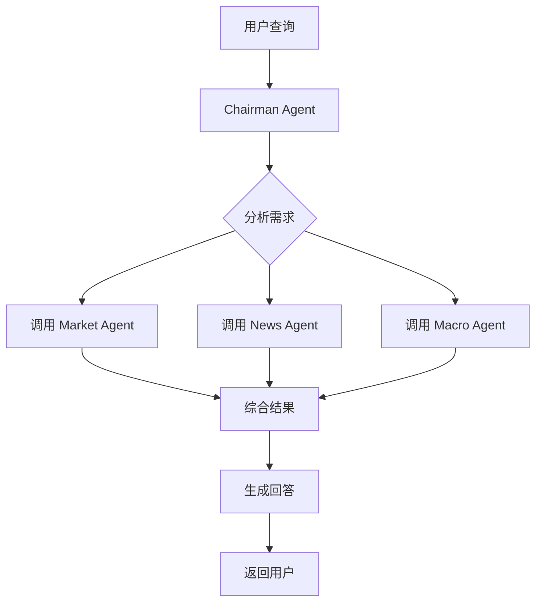
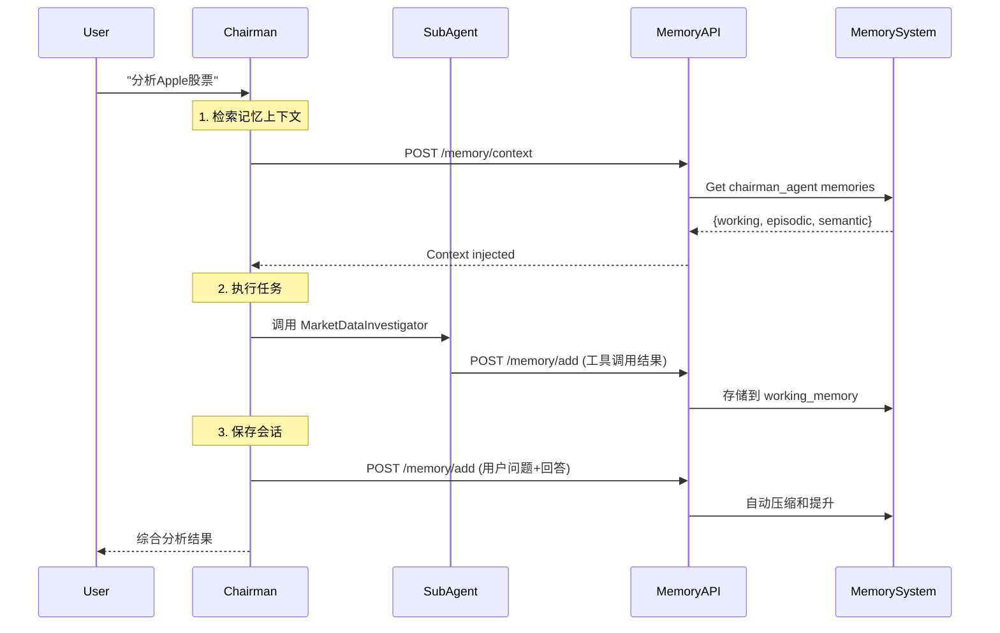

# ADK Multi-Agent System

基于 Google ADK 的智能金融分析多 Agent 系统，由 Chairman Agent 统筹协调多个专业化子 Agent，提供全面的股票市场分析和金融洞察。

[](https://www.python.org/downloads/)
[](https://github.com/google/adk)
[](LICENSE)

## 📋 目录

- [功能特性](#-功能特性)
- [系统架构](#-系统架构)
- [Multi-Agent 协作](#-multi-agent-协作)
- [快速开始](#-快速开始)
- [配置指南](#-配置指南)
- [API 文档](#-api-文档)
- [开发指南](#-开发指南)
- [故障排除](#-故障排除)

---

## 🌟 功能特性

### 核心功能

- **🤖 Multi-Agent 协作系统**
  - Chairman Agent 统筹协调
  - 5 个专业化子 Agent
  - 智能任务分发与结果综合

- **📊 实时市场数据**
  - 股票价格查询（US/HK/A-share）
  - 财务指标分析（营收、利润、PE等）
  - 宏观经济数据（GDP、CPI、VIX等）

- **📰 新闻与情绪分析**
  - 高质量新闻搜索（Tavily API）
  - 金融文本情绪分析（FinBERT）
  - 市场热点追踪

- **📄 财报深度分析**
  - 财报自动查找与下载
  - PDF/HTML 内容解析
  - LLM 驱动的智能分析

### 技术特性

- ✅ 基于 Google ADK 框架
- ✅ 支持自定义 LLM（DeepSeek via SiliconFlow）
- ✅ 延迟初始化，高效资源管理
- ✅ 流式响应，实时交互
- ✅ RESTful API 接口
- ✅ 完整的错误处理和降级策略

---

## 🏗️ 系统架构

### 整体架构

```
┌─────────────────────────────────────────────────────────────┐
│                      Frontend (React)                        │
└────────────────────────┬────────────────────────────────────┘
                         │ HTTP/SSE
                         ▼
┌─────────────────────────────────────────────────────────────┐
│                   API Layer (FastAPI)                        │
│  ┌────────────────────────────────────────────────────────┐ │
│  │            api/receptionist.py                          │ │
│  │  - /chat endpoint (POST)                                │ │
│  │  - Event streaming (NDJSON)                             │ │
│  └────────────────────────────────────────────────────────┘ │
└────────────────────────┬────────────────────────────────────┘
                         │
                         ▼
┌─────────────────────────────────────────────────────────────┐
│                    Agent Layer (ADK)                         │
│  ┌────────────────────────────────────────────────────────┐ │
│  │               Chairman Agent                            │ │
│  │  ┌──────────┬──────────┬──────────┬──────────┬────────┐│ │
│  │  │ Market   │  Macro   │   News   │Sentiment │ Report ││ │
│  │  │ Agent    │  Agent   │  Agent   │  Agent   │ Agent  ││ │
│  │  └──────────┴──────────┴──────────┴──────────┴────────┘│ │
│  └────────────────────────────────────────────────────────┘ │
└────────────────────────┬────────────────────────────────────┘
                         │
                         ▼
┌─────────────────────────────────────────────────────────────┐
│                  Core Layer (Utilities)                      │
│  ┌──────────────┬──────────────┬──────────────────────────┐ │
│  │ core/tools   │ core/llm     │ core/agent_factory       │ │
│  │ - 工具包装   │ - LLM配置    │ - Agent工厂              │ │
│  └──────────────┴──────────────┴──────────────────────────┘ │
└────────────────────────┬────────────────────────────────────┘
                         │
                         ▼
┌─────────────────────────────────────────────────────────────┐
│                  Tools Layer (../tools/registry.py)              │
│  ┌────────┬─────────┬────────┬─────────┬──────────────────┐ │
│  │ Market │ Search  │ Reports│Sentiment│ Analysis         │ │
│  │ Data   │ APIs    │ Parser │ FinBERT │ LLM              │ │
│  └────────┴─────────┴────────┴─────────┴──────────────────┘ │
└─────────────────────────────────────────────────────────────┘
                         │
                         ▼
┌─────────────────────────────────────────────────────────────┐
│          Memory System (独立微服务 - Port 10000)             │
│  ┌────────────────────────────────────────────────────────┐ │
│  │               Memory Manager                            │ │
│  │  ┌──────────────┬─────────────────┬─────────────────┐ │ │
│  │  │ Working      │  Episodic       │  Semantic       │ │ │
│  │  │ Memory       │  Memory         │  Memory         │ │ │
│  │  │ (Deque)      │  (ChromaDB+     │  (ChromaDB)     │ │ │
│  │  │              │   NetworkX)     │                 │ │ │
│  │  └──────────────┴─────────────────┴─────────────────┘ │ │
│  └────────────────────────────────────────────────────────┘ │
│  • 三层记忆架构（Working → Episodic → Semantic）              │
│  • 自动压缩和提升                                             │
│  • 向量检索 + 知识图谱                                        │
│  • 每个Agent独立命名空间                                      │
└─────────────────────────────────────────────────────────────┘
```

### 目录结构

```
adk-agent/
├── README.md                    # 本文档
├── main.py                      # 程序入口
├── pyproject.toml              # 项目配置
│
├── api/
│   └── receptionist.py         # FastAPI服务器，处理HTTP请求
│
├── agents/                     # Multi-Agent定义
│   ├── chairman.py             # 主席Agent（协调者）
│   ├── market.py               # 市场数据Agent
│   ├── macro.py                # 宏观经济Agent
│   ├── news.py                 # 新闻搜索Agent
│   ├── sentiment.py            # 情绪分析Agent
│   └── report.py               # 财报分析Agent
│
├── core/                       # 核心模块
│   ├── agent_factory.py        # Agent工厂，统一创建Agent
│   ├── llm.py                  # LLM配置，环境变量管理
│   └── tools.py                # 工具包装层，连接到../tools
│
└── fintech_agent/              # 原有的单Agent（已废弃，仅供参考）
    └── ...
```

---

## 🤝 Multi-Agent 协作

### Chairman Agent（主席）

**职责**：接收用户查询，理解意图，协调子 Agent 执行任务，综合结果

```python
User: "Apple股票值得买吗？"
  ↓
Chairman:
  1. 分析需求 → 需要基本面、新闻、宏观环境
  2. 调用 MarketDataInvestigator → 获取价格、财务指标
  3. 调用 NewsInvestigator → 查找最新新闻
  4. 调用 MacroDataInvestigator → 检查大盘环境
  5. 综合分析 → 生成投资建议
```

### 专业化子 Agents

| Agent | 职责 | 工具函数 |
|-------|------|---------|
| **MarketDataInvestigator** | 股价、财务数据 | `get_stock_price`, `get_financial_metrics` |
| **MacroDataInvestigator** | 宏观经济指标 | `get_macro_data` |
| **NewsInvestigator** | 新闻搜索 | `search_market_news` |
| **SentimentInvestigator** | 情绪分析 | `analyze_sentiment` |
| **FinancialReportAgent** | 财报分析 | `get_company_report`, `analyze_report` |

### 协作流程



---

## 🧠 Memory System Integration

### 架构设计

ADK Agent系统与Memory System（独立微服务）集成，为每个Agent提供持久化记忆能力：

```
┌──────────────────────────────────────────────────────────────┐
│                  ADK Agent System                             │
│  ┌────────────────────────────────────────────────────────┐  │
│  │  Chairman Agent                                         │  │
│  │    ↓ ↓ ↓ ↓ ↓                                          │  │
│  │  [Market] [Macro] [News] [Sentiment] [Report]         │  │
│  └────────────────────────────────────────────────────────┘  │
└──────────────────────┬───────────────────────────────────────┘
                       │ HTTP API
                       │ /memory/add
                       │ /memory/context
                       ▼
┌──────────────────────────────────────────────────────────────┐
│              Memory System Service (Port 10000)               │
│  ┌────────────────────────────────────────────────────────┐  │
│  │  Per-Agent Memory Namespaces:                          │  │
│  │  • chairman_agent                                      │  │
│  │  • marketdatainvestigator_agent                        │  │
│  │  • macrodatainvestigator_agent                         │  │
│  │  • newsinvestigator_agent                              │  │
│  │  • sentimentinvestigator_agent                         │  │
│  │  • financialreportagent_agent                          │  │
│  └────────────────────────────────────────────────────────┘  │
│                                                               │
│  [Working Memory] → [Episodic Memory] → [Semantic Memory]    │
│     (Deque - RAM)     (ChromaDB + Graph)    (ChromaDB)       │
└──────────────────────────────────────────────────────────────┘
```

### 记忆流转 (Memory Flow)



### 记忆工具 (ReAct-style Memory Tools)

Each Agent can proactively use memory tools via ADK's function calling:

```python
# core/memory_tools.py

def search_memory(query: str) -> str:
    """Search agent's memory for relevant past information"""
    # Queries Memory System API
    # Returns: relevant episodic/semantic memories
    
def save_important_fact(content: str, importance: float) -> str:
    """Save an important fact to long-term memory"""
    # Stores directly to episodic memory
    # Bypasses working memory for critical info
```

**使用示例**:
```
Agent 思考: "我需要查看之前对Apple的分析..."
Agent 行动: search_memory("Apple股票分析")
Memory System 返回: "2024-11-15 分析显示Apple PE偏高..."
Agent: "结合历史记忆，我的建议是..."
```

### 前端可视化

访问 [http://localhost:3000](http://localhost:3000) → 点击"记忆可视化"：

- 查看每个Agent的三层记忆
- 搜索记忆内容
- 切换Agent命名空间
- 实时监控记忆状态


---

## 🚀 快速开始

### 前置要求

- Python 3.14+
- UV 包管理器（推荐）或 pip
- 项目根目录的 `.config.yaml`（包含 API keys）

### 安装

```bash
# 1. 进入项目目录
cd /Users/weizhifeng/github/stock-trading-platform/adk-agent

# 2. 安装依赖（使用 UV）
uv sync

# 或使用 pip
pip install -e .

# 3. 验证安装
.venv/bin/python -c "from agents.chairman import chairman_agent; print('✓ 安装成功')"
```

### 启动服务器

```bash
# 方法 1: 直接运行
.venv/bin/python main.py

# 方法 2: 使用模块方式
.venv/bin/python -m api.receptionist

# 服务器将在 http://0.0.0.0:9000 启动
```

### 测试请求

```bash
# 使用 curl 测试
curl -X POST http://localhost:9000/chat \
  -H "Content-Type: application/json" \
  -d '{
    "query": "What is the current price of AAPL?",
    "user_id": "test_user",
    "session_id": "test_session"
  }'
```

---

## ⚙️ 配置指南

### 环境配置文件

在项目**根目录**创建 `.config.yaml`：

```yaml
# /Users/weizhifeng/github/stock-trading-platform/.config.yaml

api_keys:
  # Tavily Search API - 新闻搜索
  # 获取：https://tavily.com (免费1000次/月)
  tavily: "tvly-your-api-key-here"
  
  # LlamaCloud API - PDF解析
  # 获取：https://cloud.llamaindex.ai
  llama_cloud: "llx-your-api-key-here"
  
  # SerpApi - 备用搜索（可选）
  serpapi: ""
  
  # OpenAI API - LLM（已在代码中配置）
  openai: "sk-xoadryhpubnvadszkevovyqrjmbjpehgkhdlewwrizjffofm"
  
  # SiliconFlow API
  siliconflow: "sk-xoadryhpubnvadszkevovyqrjmbjpehgkhdlewwrizjffofm"

database:
  path: "stock_data.db"
```

### 配置文件查找顺序

ConfigLoader 会按以下顺序查找配置：

1. `~/.config.yaml`（用户主目录）
2. `~/.stock_trading_platform/config.yaml`
3. 当前工作目录及其父目录（向上查找5层）

### LLM 配置

当前使用 **DeepSeek-V3.1-Terminus** 通过 SiliconFlow 代理：

- **API Base**: `https://api.siliconflow.cn/v1`
- **Model**: `openai/deepseek-ai/DeepSeek-V3.1-Terminus`
- **配置位置**: [`core/llm.py`](core/llm.py)

如需更换 LLM：

```python
# core/llm.py
os.environ["OPENAI_API_BASE"] = "your-api-base"
os.environ["AGENT_MODEL"] = "your-model-name"
```

---

## 📡 API 文档

### POST /chat

发送查询到 Chairman Agent 并接收流式响应。

**请求**：

```json
{
  "query": "分析一下 Apple 股票",
  "user_id": "user123",        // 可选，默认 "user_default"
  "session_id": "session456"   // 可选，默认 "session_default"
}
```

**响应**（NDJSON 流式）：

```json
{"type": "chunk", "content": "我来帮您分析 Apple 股票..."}
{"type": "thought", "content": "Use MarketDataInvestigator(...)"}
{"type": "chunk", "content": "当前价格为 $180.23..."}
{"type": "thought", "content": "Use NewsInvestigator(...)"}
{"type": "chunk", "content": "根据最新新闻..."}
```

**响应类型**：

- `chunk`: Agent 的输出文本（展示给用户）
- `thought`: Agent 的思考过程（工具调用、中间步骤）

### 流式响应处理

**JavaScript 示例**：

```javascript
const response = await fetch('http://localhost:9000/chat', {
  method: 'POST',
  headers: { 'Content-Type': 'application/json' },
  body: JSON.stringify({ query: '苹果股票如何？' })
});

const reader = response.body.getReader();
const decoder = new TextDecoder();

while (true) {
  const { done, value } = await reader.read();
  if (done) break;
  
  const chunk = decoder.decode(value);
  const lines = chunk.split('\n').filter(l => l.trim());
  
  for (const line of lines) {
    const event = JSON.parse(line);
    if (event.type === 'chunk') {
      console.log('Agent:', event.content);
    }
  }
}
```

---

## 🛠️ 开发指南

### 添加新的 Agent

1. **创建 Agent 文件** (`agents/new_agent.py`)：

```python
from core.agent_factory import create_agent
from core.tools import your_tool_function

new_agent = create_agent(
    name="NewInvestigator",
    description="Agent description",
    instruction="""
    You are a specialist in...
    Your goal is to...
    """,
    tools=[your_tool_function]
)
```

2. **注册到 Chairman**：

```python
# agents/chairman.py
from .new_agent import new_agent

chairman_agent = create_agent(
    ...
    tools=[
        AgentTool(agent=market_agent),
        # ... 其他 agents
        AgentTool(agent=new_agent),  # 添加新 agent
    ]
)
```

### 添加新的工具函数

1. **在 tools/ 中实现底层工具**
2. **在 `core/tools.py` 中包装**：

```python
def new_tool_function(param: str):
    """Tool description"""
    return get_registry().new_method(param)
```

3. **在 Agent 中使用**：

```python
from core.tools import new_tool_function

agent = create_agent(
    ...
    tools=[new_tool_function]
)
```

### 运行测试

```bash
# 测试完整架构
.venv/bin/python test_refactored_architecture.py

# 测试配置加载
.venv/bin/python test_config_loading.py

# 测试初始化
.venv/bin/python test_initialization.py
```

---

## 🐛 故障排除

### 问题 1: ConfigLoader 找不到 .config.yaml

**症状**：
```
{'api_keys': {'tavily': None, 'llama_cloud': None, ...}}
```

**原因**：配置文件不在搜索路径中

**解决**：
1. 确保 `.config.yaml` 在项目根目录
2. 或设置环境变量：`export TAVILY_API_KEY=...`

### 问题 2: Pydantic 序列化警告

**症状**：
```
PydanticSerializationUnexpectedValue...
```

**原因**：使用自定义 LLM 导致响应格式不匹配

**解决**：警告已在 `api/receptionist.py` 中被抑制，不影响功能

### 问题 3: 新闻搜索返回 0 条

**症状**：
```
Tavily search failed: Unauthorized
```

**原因**：Tavily API key 未配置或无效

**解决**：
1. 在 `.config.yaml` 中设置正确的 `tavily` key
2. 或使用降级的 DuckDuckGo（无需 key，但结果较差）

### 问题 4: ImportError: No module named 'tools'

**原因**：Python path 未正确设置

**解决**：
```python
# core/tools.py 已自动处理
tools_path = os.path.abspath(os.path.join(os.path.dirname(__file__), "../.."))
sys.path.insert(0, tools_path)
```

---

## 📚 相关文档

- [Google ADK 文档](https://github.com/google/adk)
- [FastAPI 文档](https://fastapi.tiangolo.com/)
- [Tavily API](https://tavily.com/docs)
- [LlamaCloud](https://docs.llamaindex.ai/en/stable/api_reference/llms/llama_cloud/)

---

## 🤝 贡献

欢迎贡献！请遵循以下步骤：

1. Fork 本仓库
2. 创建特性分支 (`git checkout -b feature/AmazingFeature`)
3. 提交更改 (`git commit -m 'Add some AmazingFeature'`)
4. 推送到分支 (`git push origin feature/AmazingFeature`)
5. 开启 Pull Request

---

## 📄 License

本项目采用 MIT License - 详见 [LICENSE](LICENSE) 文件

---

## 👥 作者

- **项目维护者**: Wei Zhifeng
- **技术栈**: Google ADK, FastAPI, DeepSeek LLM

---

## 🌐 系统状态检查

快速检查系统是否正常：

```bash
.venv/bin/python -c "
from core.llm import configure_environment
configure_environment()
from agents.chairman import chairman_agent
from core.tools import get_stock_price, search_market_news

print('✓ Chairman Agent:', chairman_agent.name)
print('✓ Model:', chairman_agent.model)
print('✓ Sub-agents:', len([t for t in chairman_agent.tools if hasattr(t, 'agent')]))

# 测试工具
result = get_stock_price('AAPL')
print('✓ Stock Price:', 'OK' if 'error' not in result else 'FAIL')

result = search_market_news('Apple')
print('✓ News Search:', f'{len(result)} articles' if isinstance(result, list) else 'FAIL')

print('\n✅ 系统就绪！')
"
```

预期输出：
```
✓ Chairman Agent: Chairman
✓ Model: openai/deepseek-ai/DeepSeek-V3.1-Terminus
✓ Sub-agents: 5
✓ Stock Price: OK
✓ News Search: 6 articles

✅ 系统就绪！
```

---

**Happy Coding! 🚀**
