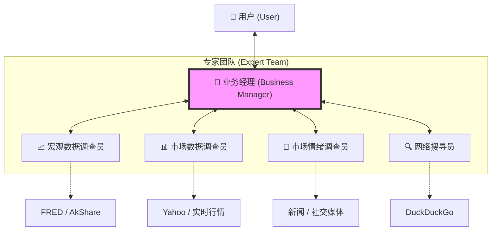

# AI-Fundin Agent Core (多 Agent 架构版)

## 1. 项目简介
本项目旨在构建一个基于 **"一人公司" (One-Person Company)** 理念的智能金融分析系统。通过引入 **多 Agent 协作 (Multi-Agent Collaboration)** 架构，系统能够模拟一支专业的金融分析团队，包括业务经理、宏观经济学家、市场分析师、舆情分析师和网络搜寻员，共同为用户提供深度、全面的投资分析服务。

## 2. 核心架构

本项目采用 **LangGraph** 框架实现 **动态协作 (Dynamic Collaboration)** 模式，类似于"圆桌会议"。

### 2.1 组织架构 (Organization)

下图展示了系统的核心角色及其关系：



### 2.3 角色定义 (Roles)

| 角色 | 职责 | 核心能力 | 模型建议 |
| :--- | :--- | :--- | :--- |
| **业务经理 (Business Manager)** | **团队大脑/主持人**。负责理解用户需求，动态调度其他 Agent 发言，把控讨论方向，并最终汇总输出。 | 复杂逻辑推理、上下文管理、决策路由 | DeepSeek-V3 / GPT-4o |
| **宏观数据调查员 (Macro Agent)** | **宏观经济专家**。负责提供宏观经济背景，如 GDP、CPI、利率政策等。 | FRED API, AkShare, Yahoo Finance | DeepSeek-V3 / GPT-4o-mini |
| **市场数据调查员 (Market Agent)** | **技术/市场专家**。负责分析具体标的的价格走势、技术指标和历史数据。 | 实时行情, K线数据, 技术指标计算 | DeepSeek-V3 / GPT-4o-mini |
| **市场情绪调查员 (Sentiment Agent)** | **舆情分析师**。负责分析新闻、社交媒体的情绪倾向，判断市场恐慌/贪婪程度。 | 新闻搜索, 情感分析模型 | DeepSeek-V3 / GPT-4o |
| **网络搜寻员 (Web Search Agent)** | **信息情报员**。负责搜索实时资讯、突发事件和非结构化信息。 | DuckDuckGo Search / Google Search | DeepSeek-V3 / GPT-4o-mini |

### 2.2 工作流 (Workflow)

1.  **用户输入**: 用户提出复杂金融问题（如："现在适合买入特斯拉吗？"）。
2.  **业务经理评估**: 分析问题，决定首先需要哪方面的信息（例如先看市场行情）。
3.  **动态路由**: 调度到对应的 Agent（如 Market Agent）。
4.  **Agent 执行**: Market Agent 调用工具获取数据，返回分析结果到公共频道。
5.  **协作迭代**:
    *   业务经理看到行情下跌，可能会问 Sentiment Agent："有什么负面新闻吗？"
    *   Sentiment Agent 查找并回复："有召回事件。"
    *   业务经理继续问 Macro Agent："这是行业普遍现象吗？"
    *   ... (循环迭代，最多 20 轮)
6.  **最终汇总**: 当信息充足时，业务经理汇总所有观点，生成最终报告。

## 3. 技术选型

*   **核心框架**: [LangGraph](https://github.com/langchain-ai/langgraph) - 用于构建有状态、多角色的图结构应用。
*   **LLM 编排**: [LangChain](https://github.com/langchain-ai/langchain) - 提供 Tool 绑定、Prompt 管理等基础能力。
*   **大语言模型**: **DeepSeek-V3** (通过 OpenAI 兼容接口调用) - 提供强大的推理和指令遵循能力。
*   **Web 框架**: FastAPI - 提供 RESTful API 接口。
*   **工具集**:
    *   `fredapi`: 美国宏观数据。
    *   `akshare`: 中国宏观/市场数据。
    *   `yfinance`: 全球市场数据。
    *   `duckduckgo-search`: 免费网络搜索。

## 4. 目录结构

```
agent/
├── core/
│   ├── graph.py          # LangGraph 图定义 (核心逻辑)
│   ├── agent.py          # Agent 接口封装
│   ├── config.py         # 配置管理
│   └── prompts.py        # 各角色 System Prompt
├── skills/               # 工具/技能实现
│   ├── macro_data_tool/
│   ├── market_data_tool/
│   ├── sentiment_analysis_tool/
│   └── web_search_tool/  # [新增]
├── tests/                # 测试用例
├── main.py               # 服务入口
└── requirements.txt      # 依赖管理
```
