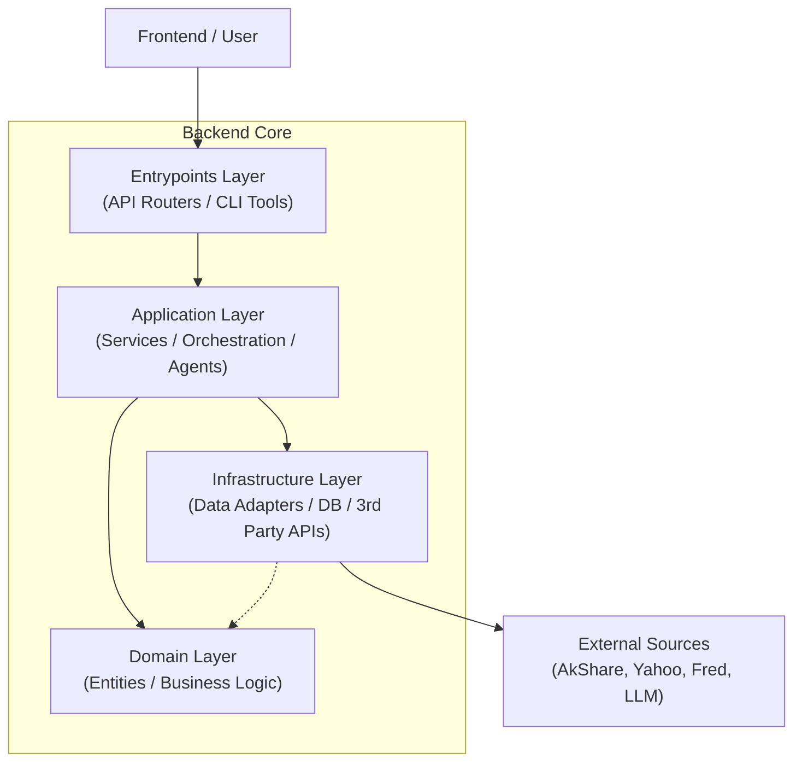
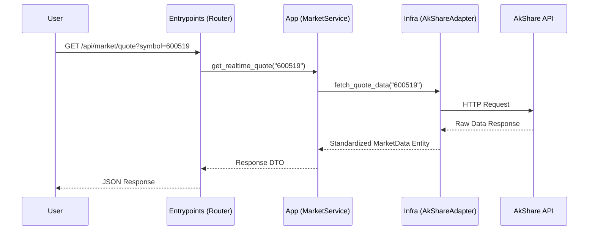

# 🧠 Backend Context

## 🎯 模块职责 (Current Scope)
这是整个 AI 基金经理系统的**后端核心**。
它基于 **DDD (领域驱动设计)** 架构，负责处理所有的业务逻辑、AI 智能体编排、数据获取与 API 响应。

主要职责：
- **API 服务**: 提供 RESTful API 供前端调用。
- **AI 智能体**: 托管所有金融分析 Agent (技术面、宏观面、舆情等)。
- **数据处理**: 对接外部数据源 (AkShare, Yahoo, Fred) 并进行标准化。

## 🏗️ 架构与交互 (Architecture & Relationships)

### 分层架构图 (Layered Architecture)

### 核心层级说明

1.  **接入层 (Entrypoints)**: `entrypoints/`
    - **职责**: 外部请求的入口，处理 HTTP 协议解析、参数校验、路由分发。
    - **关键组件**: FastAPI Router, CLI 工具 (Debug)。
    - **交互**: 仅调用 `app/` 层的 Service，不直接接触 DB 或外部 API。

2.  **应用层 (Application)**: `app/`
    - **职责**: 业务用例的编排者。它协调 Agents 执行任务，或调用 Service 获取数据。
    - **关键组件**: `MarketService`, `TechnicalAgent`, `MacroAgent`。
    - **交互**: 编排 `domain/` 实体，通过接口调用 `infrastructure/`。

3.  **领域层 (Domain)**: `domain/`
    - **职责**: 纯粹的业务实体与逻辑，不依赖任何外部框架。
    - **关键组件**: `ReportContent` (研报实体), `StockAnalysis` (分析结果)。
    - **交互**: 被 App 层调用，被 Infra 层引用（作为返回值）。

4.  **基础设施层 (Infrastructure)**: `infrastructure/`
    - **职责**: 技术实现细节。实现数据获取、数据库读写、LLM 调用。
    - **关键组件**: `AkShareAdapter`, `YahooFinanceAdapter`, `PostgresDB`。
    - **交互**: 实现 `app/` 定义的接口。

### 关键数据流 (Data Flow)

**场景：用户请求个股行情**

## 🔑 关键概念与指标 (Key Concepts & Metrics)

### 核心概念
- **Agent (智能体)**: 基于 Google ADK 或 LangChain 构建的独立思考单元，拥有 Tools (工具) 和 Memory (记忆)。
- **Tool (工具)**: Agent 与外部世界交互的唯一方式（如“查询股价”、“搜索新闻”）。
- **Service (服务)**: 传统的业务逻辑单元，用于处理非 AI 的确定性任务（如数据格式化、CRUD）。

### 关键指标 (Key Metrics)
- **响应延迟 (Latency)**: 
  - 普通数据 API: < 500ms
  - AI 流式响应: 首字延迟 < 2s
- **数据源覆盖**:
  - A股 (AkShare)
  - 美股 (Yahoo Finance)
  - 宏观 (Fred)
- **并发支持**: 基于 FastAPI + Uvicorn 的异步模型，支持高并发 I/O。

## 🗺️ 导航与细节 (Navigation & Drill-down)

### 📂 核心子目录 (Sub-directories)

> 💡 **AI 提示**: 阅读下方目录中的 `Context.md` 可获取更详细的局部信息。

*   **`entrypoints/`**: [接入层] - API 路由定义与命令行入口。
*   **`app/`**: [应用层] - Agent 实现与业务 Service。
*   **`infrastructure/`**: [基础设施] - 外部 API (AkShare, Yahoo) 适配器与数据库。
*   **`domain/`**: [领域层] - 核心实体定义。

### 📄 根目录关键文件 (Key Files)

*   **`dev_server.py`**: 开发环境启动脚本 (带有自动重载)。
*   **`requirements.txt`**: Python 依赖列表。
*   **`.config.yaml`**: (需从 example 复制) 系统配置文件，包含 API Key。
