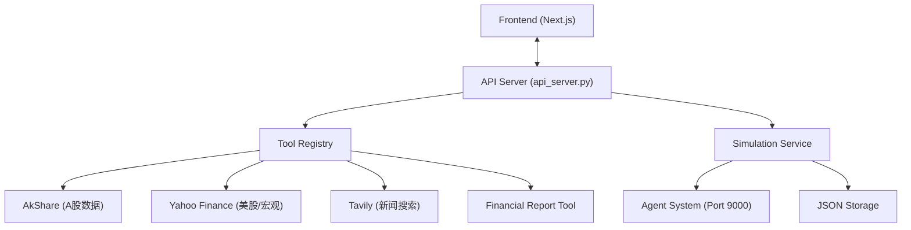

# Backend Service

这是 AI 基金经理项目的后端服务模块，负责处理前端请求、数据聚合、模拟交易逻辑以及与 AI Agent 的交互。

## 架构概览

后端采用 Python 原生 `http.server` 构建的轻量级 API 服务，核心架构如下：



## 核心组件

### 1. API Server (`api_server.py`)
主入口文件，运行在 `8000` 端口。提供 HTTP 接口，通过 `MarketDataAPIHandler` 路由请求到相应的处理函数。

### 2. Simulation Service (`services/simulation_service.py`)
模拟交易的核心引擎。
-   **功能**：管理模拟账户、执行交易指令、聚合多因子数据 (Multi-Factor Data Aggregation)。
-   **流程**：
    1.  收集行情 (Technical)、财务 (Fundamental)、宏观 (Macro)、舆情 (Sentiment) 数据。
    2.  构造 Prompt 发送给 Agent。
    3.  解析 Agent 的 JSON 决策。
    4.  更新账户状态并记录日志。
-   **存储**：数据持久化在 `backend/data/simulations.json`。

### 3. Tool Registry (`tools/registry.py`)
工具注册表模式，统一管理所有外部数据源的调用。屏蔽了底层数据源（AkShare/Yahoo/Tavily）的差异，提供统一接口。

## API 接口文档

### 市场数据 (Market Data)
| 方法 | 路径 | 描述 |
| :--- | :--- | :--- |
| `POST` | `/api/market-data` | 查询实时股票数据 |
| `GET` | `/api/market-data/hot` | 获取热门股票列表 |
| `GET` | `/api/market/historical/<symbol>` | 获取历史K线数据 |
| `GET` | `/api/market/technical/<symbol>` | 获取技术分析数据 (含MA/MACD/RSI/KDJ/BOLL) |

### 模拟交易 (Simulation)
| 方法 | 路径 | 描述 |
| :--- | :--- | :--- |
| `GET` | `/api/simulation/tasks` | 获取所有模拟任务 |
| `GET` | `/api/simulation/task/<task_id>` | 获取单个任务详情 |
| `POST` | `/api/simulation/create` | 创建新模拟任务 |
| `POST` | `/api/simulation/run` | **核心接口**: 执行单日模拟回测 (Run Day) |

### 其他
| 方法 | 路径 | 描述 |
| :--- | :--- | :--- |
| `POST` | `/api/tools/financial_report_tool/get_financial_indicators` | 获取财务指标 |
| `GET` | `/api/financial-report/<symbol>` |获取财报摘要 |
| `GET` | `/api/web-search` | 执行相关新闻搜索 |

## 数据流 (Data Flow)

**以 "Run Day" 为例：**
1.  **Frontend** 发起 `POST /api/simulation/run` 请求。
2.  **API Server** 接收请求，调用 `simulation_service.run_daily_simulation`。
3.  **Simulation Service** 通过 `Tools` 获取该股票的各类因子数据。
4.  **Simulation Service** 构造 Prompt，请求 Agent API (`localhost:9000`)。
5.  **Agent** 进行思考 (CoT) 并返回 JSON 决策。
6.  **Simulation Service** 执行买卖逻辑，计算 `stock_value`，更新 `simulations.json`。
7.  **Response** 返回给前端，前端更新图表和日志。

## 环境与依赖

依赖管理使用 `requirements.txt` (推荐使用 `uv` 管理)。

主要依赖：
-   `http.server` (标准库): Web 服务
-   `requests`: HTTP 客户端
-   `pandas`, `numpy`: 数据处理与指标计算
-   `akshare`: A股数据源
-   `yfinance` (可选): 美股数据
-   `ta-lib` (或手动实现的 `technical.py`): 技术指标

## 快速开始

1.  **激活环境**:
    ```bash
    source ../.venv/bin/activate
    ```

2.  **启动服务**:
    ```bash
    python api_server.py
    ```
    服务将启动在 `http://localhost:8000`。

3.  **开发调试**:

## 数据源说明 (Data Sources)

### 1. 宏观数据 (Macro Data)
宏观数据接口 (`/api/market-data/macro`) 根据请求的指标类型自动路由到不同的上游数据源。

| 指标类型 | 具体指标 | 数据源 | 原理/备注 |
| :--- | :--- | :--- | :--- |
| **中国宏观** | GDP, M2, LPR, PPI, PMI | **AkShare** | 直接调用 AkShare 相关接口 (如 `macro_china_gdp`, `macro_china_lpr`) 获取官方统计局发布的最新数据。 |
| **中国通胀** | CPI | **AkShare** | 调用 `macro_china_cpi` 获取全国居民消费价格指数。 |
| **美国/全球** | US GDP, Unemployment | **FRED** | 调用 St. Louis Fed (FRED) API 获取权威美国经济数据。 |
| **美国通胀** | US CPI | **FRED** | 调用 FRED API 获取 `CPIAUCSL` (Consumer Price Index for All Urban Consumers)。 |
| **利率相关** | Fed Funds Rate | **FRED** | 获取联邦基金利率。 |
| **市场指标** | VIX, DXY, US10Y | **Yahoo Finance** | 通过 `yfinance` 获取实时行情数据 (如 `^VIX`, `DX-Y.NYB`, `^TNX`)。 |

### 2. 财报数据 (Financial Reports)
财务指标接口 (`/api/tools/financial_report_tool/get_financial_indicators`) 采用多级降级策略以确保数据的高可用性。

#### A股 (A-Share)
**首选源**: AkShare (`stock_financial_analysis_indicator`)
**备选源**: Yahoo Finance (当 AkShare 数据缺失时自动触发)

| 指标分类 | 具体指标 | 计算方式 / 来源逻辑 |
| :--- | :--- | :--- |
| **收入端** | 营业收入YoY | 直接取自财报 `主营业务收入增长率`。 |
| | 核心营收占比 | 取自 `主营利润比重` (若 Yahoo源则为 `N/A`)。 |
| | 现金收入比 | **AkShare**: `每股经营性现金流 > 0 ? 1 : 0` (简化逻辑) <br> **Yahoo**: `经营现金流 / 总营收`。 |
| **利润端** | 扣非归母净利(EPS) | **AkShare**: 取自 `扣除非经常性损益后的每股收益`。 <br> **Yahoo**: 降级使用 `Basic EPS` (基本每股收益)。 |
| | 经营毛利率 | `销售毛利率` (Gross Profit / Revenue)。 |
| | 核心净利率 | `销售净利率` (Net Profit / Revenue)。 |
| **现金流** | 经营现金流/净利 | `每股经营性现金流 / 每股收益`。 |
| | 自由现金流 (FCF) | **AkShare**: 暂不支持 (`N/A`)。 <br> **Yahoo**: `Free Cash Flow` 字段。 |
| **负债端** | 资产负债率 | `总负债 / 总资产`。 |
| | 流动比率 | `流动资产 / 流动负债` (Yahoo源通过资产负债表计算)。 |
| **股东回报** | ROE (净资产收益率) | `净资产收益率` (Net Income / Shareholder Equity)。 |
| | 股息率 | 取自最近一期分红数据或 TTM 计算。 |

#### 美股/港股 (US/HK)
**唯一源**: Yahoo Finance (`yfinance`)

- **数据获取**: 直接解析 Yahoo Finance 提供的 Income Statement, Balance Sheet, Cash Flow Statement。
- **计算逻辑**: 与上述 A股 Yahoo 备选源逻辑一致。
- **特殊处理**: 港股代码会自动标准化 (如 `0700` -> `0700.HK`)。
