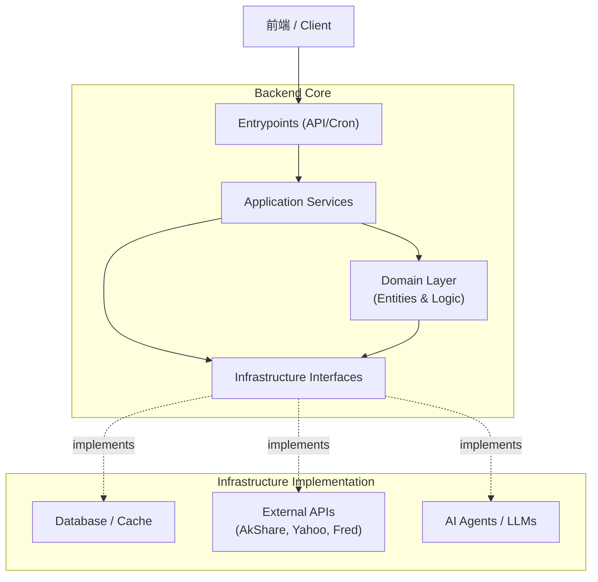
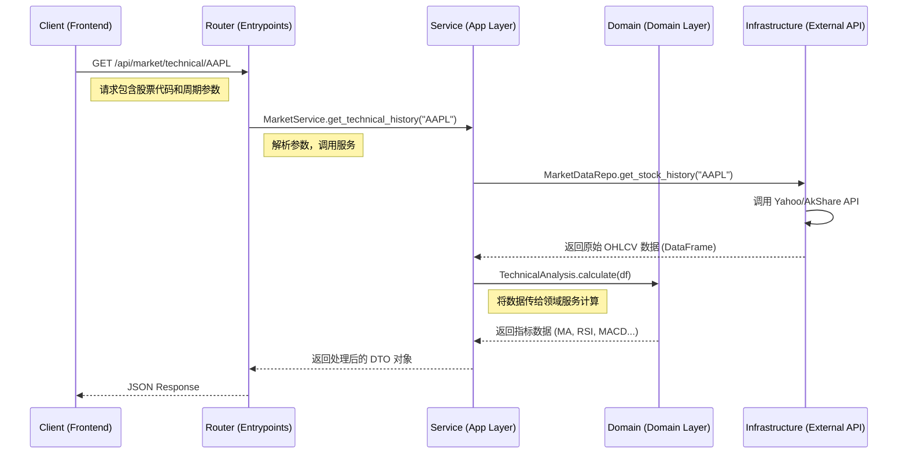

# AI Funding Backend

AI 基金经理项目的核心后端服务，基于 **DDD (Domain-Driven Design)** 架构重构，提供 RESTful API 以支持前端应用与 AI Agent 的交互。旨在通过多智能体协作（Multi-Agent Collaboration）实现从数据获取、逻辑分析到最终决策的全流程自动化。

## 🏗 架构概览 (Architecture)

后端采用典型的分层架构，职责清晰，易于维护和扩展。

### 核心分层 (Layers)

| 层级 (Layer) | 目录 | 职责 (Responsibility) |
| :--- | :--- | :--- |
| **Entrypoints** | `backend/entrypoints/` | **接入层**。负责接收外部请求 (HTTP/WebSocket/Cron)，解析参数，验证输入，调用 Application Service。**不包含业务逻辑**。 |
| **Application** | `backend/app/` | **应用层 (Orchestration)**。负责业务流程编排、服务协调、事务控制。它指挥 Domain 和 Infrastructure 工作。 |
| **Domain** | `backend/domain/` | **领域层 (Core Business)**。包含核心业务实体 (Entities) 和纯粹的业务计算逻辑 (Domain Services)。**不依赖**数据库或外部 API，只依赖抽象接口。 |
| **Infrastructure** | `backend/infrastructure/` | **基础设施层 (Adapters)**。负责具体的“脏活累活”，如数据库访问、外部 API 调用 (AkShare/Fred/Yahoo)、文件存储、日志记录等。实现 Domain 定义的接口。 |

### 系统架构流图



## 🧩 核心业务服务 (Core Services)

位于 `backend/app/services/`，是连接 API 与底层逻辑的枢纽。

| 服务类 | 核心职责 | 关键实现 |
| :--- | :--- | :--- |
| **MarketService** | **基础行情网关**。提供 K 线数据、实时报价、历史行情查询。 | 封装 AkShare/Yahoo API；集成 `TA-Lib` 计算 SMA, RSI, MACD 等技术指标。 |
| **ReportAnalysisService** | **智能财报分析**。阅读并解读长篇 PDF/文本财报。 | 集成 LLM (DeepSeek/GPT-4o)；实现长文本分块处理；提取 Revenue, EPS, Cash Flow 等财务指标。 |
| **NewsSentimentService** | **舆情与情绪分析**。分析市场新闻情绪，判断多空倾向。 | 驱动 Headless Browser (Steel Browser) 联网搜索；使用 FinBERT 或 LLM 进行情绪打分 (-1 to 1)。 |
| **TechnicalAgentService** | **技术面分析专家**。模拟专业交易员分析盘面。 | 动态注入技术指标上下文；Prompt Engineering 引导 LLM 进行形态识别和趋势判断。 |
| **MacroAgentService** | **宏观经济分析**。分析宏观数据对股市的影响。 | 调用 FRED API 获取 GDP, CPI, 利率数据；生成宏观经济简报。 |

## 🤖 AI Agent 体系

本项目采用 **CoT (Chain of Thought)** 和 **ReAct** 模式构建智能体，基于 Google ADK (Agent Development Kit) 框架。

*   **Coordinator Agent (Chairman)**: 总控代理，负责拆解用户任务，分发给专业 Agent (如 "分析 AAPL" -> 调动技术、基本面、舆情 Agent)，并汇总最终报告。
*   **Technical Analysis Agent**: 专注于量化数据解读。它不只是看涨跌，还能识别 "底背离"、"金叉" 等技术形态。
*   **News Search Agent**: 具备联网能力的侦查员。利用 Search Tool 搜索实时新闻，过滤噪音，提取关键市场驱动事件。
*   **Financial Report Agent**: 专注于深度阅读。能处理上百页的 10-K/10-Q 报告，通过 RAG (Retrieval-Augmented Generation) 技术精准定位关键财务数据锚点。

## 🧠 分析原理 (Analysis Principles)

揭示 "AI 如何像基金经理一样思考" 的核心逻辑：

### 1. 技术分析 (Technical Analysis)
*   **原理**: **Data Context Injection (数据上下文注入)**。
*   **流程**: 后端不直接把 K 线图喂给 LLM（视觉模型成本高且不精确）。而是先通过 `MarketService` 计算出精确的硬指标（如 "MA5=150.2, MA20=145.8, RSI=72"），将这些数值转化为结构化的自然语言描述，注入到 System Prompt 中。LLM 负责基于这些“事实”进行逻辑推理（如 "MA5 上穿 MA20 且 RSI > 70，提示短期超买但趋势向上"）。

### 2. 基本面分析 (Fundamental Analysis)
*   **原理**: **Key Information Extraction (关键信息抽取)**。
*   **流程**: 针对非结构化的财报 PDF，系统先进行 OCR 和文本清洗。利用 Prompt Engineering 要求 LLM 遵循特定的 JSON Schema 提取核心字段（营收、净利润、毛利率等）。同时，要求 LLM 对 MD&A (管理层讨论) 章节进行摘要，提炼出 "未来展望" 和 "潜在风险"。

### 3. 情绪分析 (Sentiment Analysis)
*   **原理**: **Search & Scoring (搜索与打分)**。
*   **流程**: 用户关注某标的时，News Agent 主动在 Google/Bing 发起搜索。获取 Top-N 新闻标题和摘要。使用专门训练的金融情感模型 (如 FinBERT) 或通用 LLM 对每条新闻进行打分（-1为极度悲观，+1为极度乐观），最终加权计算出该标的的当日情绪指数。

## 📂 目录结构说明 (Directory Structure)

```text
backend/
├── app/                  # 应用层
│   ├── services/         # 业务服务类 (上述 Core Services)
│   ├── agents/           # AI Agent 定义 (ADK Agent, Prompts)
│   └── ...
├── domain/               # 领域层
│   ├── entities/         # 领域实体 (Stock, Report, News)
│   └── ...
├── entrypoints/          # 接入层
│   ├── api/
│   │   ├── routers/      # FastAPI 路由 (RESTful API 定义)
│   │   └── server.py     # FastAPI Server 入口
│   └── ...
├── infrastructure/       # 基础设施层
│   ├── external_apis/    # 数据源 (AkShare, Yahoo, Fred, Tavily)
│   └── ...
```

## 🔄 数据流 (Data Flow)

以 **"获取技术指标历史数据"** 为例，展示数据如何在各层间流动：



## 🚀 快速开始 (Usage)

### 1. 环境准备
确保已安装 Python 3.10+ 及依赖：
```bash
# 使用 uv 或 pip 安装依赖
pip install -r requirements.txt
```

### 2. 启动服务 (Production/Standard)
进入项目根目录：
```bash
# 注意模块路径
python -m backend.entrypoints.api.server
```
服务默认运行在 `http://0.0.0.0:8000`。

### 3. 开发模式 (Hot Reload)
开发时推荐使用 `dev_server.py`，它会在代码修改后自动重启服务：
```bash
# 在项目根目录运行
python backend/dev_server.py
```
