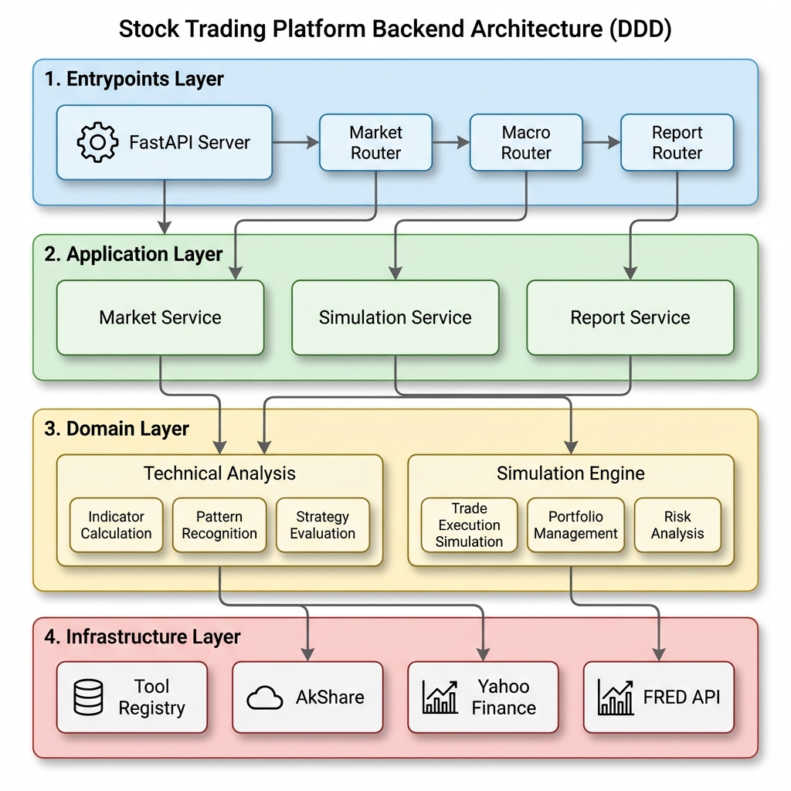

# AI Funding Backend

AI 基金经理项目的核心后端服务，基于 **DDD (Domain-Driven Design)** 架构重构，提供 RESTful API 以支持前端应用与 AI Agent 的交互。

## 🏗 架构概览 (Architecture)

后端采用典型的分层架构，职责清晰，易于维护和扩展。

### 核心分层 (Layers)

| 层级 (Layer) | 目录 | 职责 (Responsibility) |
| :--- | :--- | :--- |
| **Entrypoints** | `backend/entrypoints/` | **接入层**。负责接收外部请求 (HTTP/WebSocket)，解析参数，调用 Application Service。不包含业务逻辑。 |
| **Application** | `backend/app/` | **应用层 (Orchestration)**。负责业务流程编排、服务协调、事务控制。它指挥 Domain 和 Infrastructure 工作。 |
| **Domain** | `backend/domain/` | **领域层 (Core Business)**。包含核心业务实体 (Entities) 和纯粹的业务计算逻辑 (Domain Services)。**不依赖**数据库或外部 API。 |
| **Infrastructure** | `backend/infrastructure/` | **基础设施层 (Adapters)**。负责具体的“脏活累活”，如数据库访问、外部 API 调用 (AkShare/Fred/Yahoo)、文件存储等。 |

### 系统架构图



## 🔄 数据流 (Data Flow)

以 **"获取技术指标历史数据"** 为例：

1.  **Request**: 前端请求 `GET /api/market/technical/AAPL?period=1y`。
2.  **Entrypoints**: `api/routers/market.py` 接收请求，解析参数。
3.  **App Service**: 调用 `MarketService.get_technical_history("AAPL")`。
4.  **Infrastructure**: `MarketService` 调用 `Registry` -> `YahooTool` 获取 AAPL 最近 1 年的原始 OHLCV 数据。
5.  **Domain Service**: `MarketService` 将原始数据传给 `TechnicalAnalysisTool.calculate_indicators_history()`。
    *   领域服务纯计算：MA, RSI, MACD, BOLL。
6.  **Response**: 计算结果返回给 Service -> Router -> Frontend。

## 🚀 快速开始 (Usage)

### 1. 环境准备
确保已安装 Python 3.10+ 及依赖：
```bash
# 使用 uv 或 pip 安装依赖
pip install -r requirements.txt
```

### 2. 启动服务 (Production/Standard)
进入项目根目录：
```bash
# 注意模块路径
python -m backend.entrypoints.api.server
```
服务默认运行在 `http://0.0.0.0:8000`。

### 3. 开发模式 (Hot Reload)
开发时推荐使用 `dev_server.py`，它会在代码修改后自动重启服务：
```bash
# 在项目根目录运行
python backend/dev_server.py
```

## 📚 API 接口主要模块

| 模块 (Router) | 路径前缀 | 说明 |
| :--- | :--- | :--- |
| **Market** | `/api/market` | 基础行情、K线、技术指标 (`/technical`) |
| **Macro** | `/api/macro-data` | 宏观经济数据 (GDP, CPI, Fed Rates) |
| **Report** | `/api/financial-report` | 财报分析、财务指标 |
| **Simulation** | `/api/simulation` | 模拟交易任务管理、Chat 交互 (`/chat`) |
| **Search** | `/api/web-search` | 联网搜索接口 |

## 🛠 开发指南

### 新增 API 流程
1.  **Define**: 在 `backend/entrypoints/api/routers/` 新建或修改 Router。
2.  **App Logic**: 在 `backend/app/services/` 中实现业务编排逻辑。
3.  **Domain Logic**: (如有复杂计算) 在 `backend/domain/` 中实现核心算法。
4.  **Test**: 使用 `backend/dev_server.py` 启动并验证。

### 常见问题
*   **Nano/Inf 报错**: API 返回 `NaN` 会导致 JSON 序列化失败。请使用 `backend.infrastructure.utils.json_helpers.clean_nans` 处理返回值。
*   **CORS**: `server.py` 已配置允许所有跨域请求 (`allow_origins=["*"]`)。
