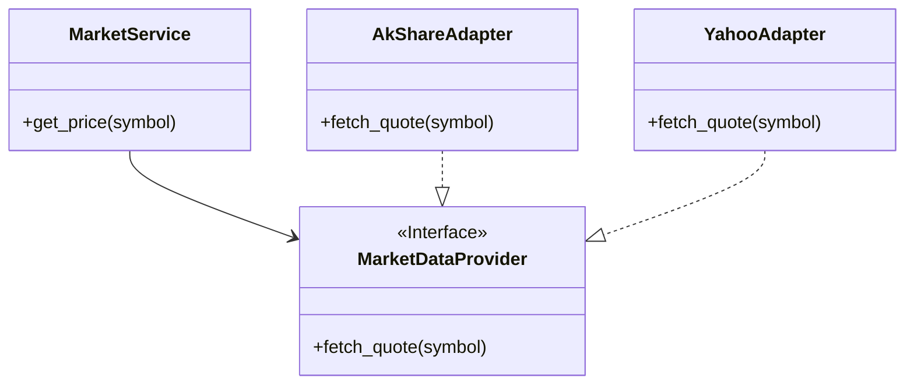

# 🧱 Backend Infrastructure Context

## 🎯 模块职责 (Current Scope)
本目录是后端系统的**基础设施层 (Infrastructure Layer)**，负责所有与“外部世界”的物理交互。
它屏蔽了底层的技术细节（如 SQL 语句、HTTP 请求参数、API 签名），向应用层提供干净、统一的 Python 接口。

主要职责：
1.  **数据适配 (Adapters)**: 对接 AkShare, Yahoo, Fred 等外部数据源。
2.  **持久化 (Persistence)**: 管理数据库连接 (SQLAlchemy) 和数据模型映射。
3.  **工具集成 (Integrations)**: 集成搜索引擎 (Tavily)、浏览器 (Playwright/Steel) 等第三方工具。

## 🏗️ 架构与交互 (Architecture & Relationships)

### 适配器模式 (Adapter Pattern)
本层核心采用适配器模式，确保上层业务逻辑不依赖具体的数据源实现。

## 🗺️ 导航与细节 (Navigation & Drill-down)

### 📂 子模块索引

*   **`market/`**: [行情源] - 核心行情数据适配器。
    *   `akshare_tool.py`: A股数据 (基于 AkShare)。
    *   `yahoo.py`: 美股/港股数据 (基于 yfinance)。
    *   `fred.py`: 宏观经济数据 (基于 FRED API)。
*   **`database/`**: [数据库] - PostgreSQL/SQLite 连接与 ORM 模型。
    *   `engine.py`: DB Session 管理。
    *   `models/`: SQLAlchemy 模型定义。
*   **`search/`**: [搜索] - 网络搜索工具封装 (Tavily, DuckDuckGo)。
*   **`browser/`**: [浏览器] - 无头浏览器控制，用于爬取动态网页。
*   **`adk/`**: [Agent Kit] - Google ADK 的核心实现与扩展。

### 🔑 关键文件说明
*   **`config/loader.py`**: 全局配置加载器，负责读取 `.config.yaml`。
