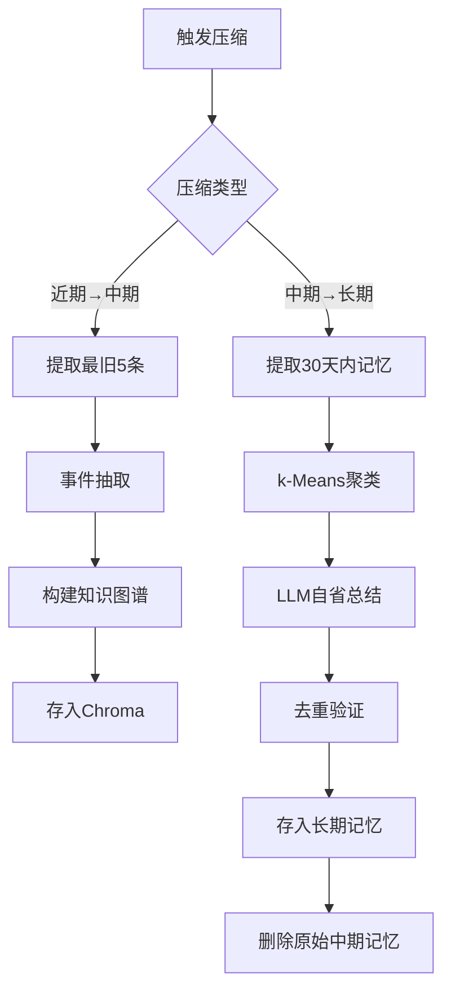

# Memory System - Detailed Design Document

## 📋 目录

- [设计目标](#设计目标)
- [三层记忆详解](#三层记忆详解)
- [记忆流转机制](#记忆流转机制)
- [检索策略](#检索策略)
- [压缩算法](#压缩算法)
- [性能优化](#性能优化)
- [安全与隔离](#安全与隔离)

---

## 🎯 设计目标

### 核心目标

1. **独立性**：完全解耦，通过API通信
2. **高性能**：检索延迟 <100ms
3. **可扩展**：支持100+ Agent并发
4. **智能化**：自动压缩和优化
5. **可追溯**：完整的记忆溯源链

### 非功能性需求

| 指标 | 目标值 | 测量方法 |
|------|--------|---------|
| API响应时间 | <100ms (P95) | Prometheus监控 |
| 检索准确率 | >85% | 人工标注评估 |
| 并发支持 | 100 QPS | 压力测试 |
| 数据持久化 | 99.9% | 定期备份验证 |
| 内存占用 | <2GB | 系统监控 |

---

## 🧠 三层记忆详解

### 1. 近期记忆（Working Memory）

#### 设计原理

基于**操作系统虚拟内存**的思想，近期记忆相当于"主内存"，存储最近的对话上下文。

#### 数据结构

```python
from collections import deque
from dataclasses import dataclass
from datetime import datetime

@dataclass
class WorkingMemoryItem:
    """近期记忆单元"""
    id: str
    agent_id: str
    session_id: str
    timestamp: datetime
    role: str  # "user" | "agent" | "system"
    content: str
    tokens: int
    importance: float  # 0.0-1.0
    protected: bool = False  # 是否受保护不被淘汰

class WorkingMemory:
    """近期记忆管理器"""
    
    def __init__(self, max_items: int = 50, max_tokens: int = 8000):
        self.items: deque[WorkingMemoryItem] = deque(maxlen=max_items)
        self.max_tokens = max_tokens
        self.agent_sessions: dict[str, deque] = {}  # agent_id -> session memories
    
    def add(self, item: WorkingMemoryItem) -> None:
        """添加记忆，自动处理溢出"""
        # 检查Token限制
        while self._total_tokens() + item.tokens > self.max_tokens:
            self._compress_oldest()
        
        self.items.append(item)
    
    def _compress_oldest(self) -> None:
        """压缩最旧的N条记忆"""
        # 找到最旧的5条非保护记忆
        to_compress = []
        for item in list(self.items):
            if not item.protected and len(to_compress) < 5:
                to_compress.append(item)
                self.items.remove(item)
        
        if to_compress:
            # 生成摘要
            summary = self._summarize(to_compress)
            # 转移到中期记忆
            self._move_to_episodic(to_compress)
            # 插入摘要到队首
            self.items.appendleft(summary)
    
    def to_context(self) -> str:
        """转换为LLM上下文"""
        return "\n".join([
            f"{item.role}: {item.content}"
            for item in self.items
        ])
```

#### Token管理策略

```python
class TokenBudgetManager:
    """Token预算管理器"""
    
    BUDGET = {
        "system_base": 800,
        "core_principles": 500,
        "working_memory": 8000,
        "episodic_memory": 2000,
        "semantic_memory": 500,
        "tools": 2000,
        "response": 4000
    }
    
    def allocate(self, memory_type: str) -> int:
        """分配Token预算"""
        return self.BUDGET.get(memory_type, 0)
    
    def check_overflow(self, current_tokens: int, budget: int) -> bool:
        """检查是否超出预算"""
        return current_tokens > budget
```

---

### 2. 中期记忆（Episodic Memory）

#### 设计原理

基于**事件溯源（Event Sourcing）**模式，存储结构化的事件而非原始对话。

#### 事件抽取

```python
from typing import List, Dict, Tuple

class EventExtractor:
    """事件抽取器"""
    
    def extract(self, conversation: str) -> List[EpisodicEvent]:
        """从对话中提取结构化事件"""
        # 使用LLM提取事件
        prompt = f"""
从以下对话中提取关键事件，格式化为JSON：

对话：
{conversation}

提取以下信息：
1. event_type: 事件类型（stock_analysis/news_search/user_preference等）
2. entities: 涉及的实体列表
3. relations: 三元组关系列表 (subject, predicate, object)
4. key_findings: 关键发现（dict格式）
5. importance: 重要性评分（0-1）
"""
        
        # 调用LLM
        response = self.llm.generate(prompt)
        events = self._parse_events(response)
        
        return events

@dataclass
class EpisodicEvent:
    """中期记忆事件"""
    id: str
    agent_id: str
    event_type: str
    entities: List[str]
    relations: List[Tuple[str, str, str]]  # (subject, predicate, object)
    key_findings: Dict
    timestamp: datetime
    importance: float
    embedding: List[float]
    access_count: int = 0
    last_accessed: datetime = None
```

#### 知识图谱构建

```python
import networkx as nx

class KnowledgeGraph:
    """知识图谱管理器"""
    
    def __init__(self):
        self.graph = nx.MultiDiGraph()
    
    def add_event(self, event: EpisodicEvent) -> None:
        """将事件添加到知识图谱"""
        # 添加实体节点
        for entity in event.entities:
            if not self.graph.has_node(entity):
                self.graph.add_node(entity, type="entity")
        
        # 添加关系边
        for subject, predicate, obj in event.relations:
            self.graph.add_edge(
                subject, obj,
                relation=predicate,
                event_id=event.id,
                timestamp=event.timestamp,
                weight=event.importance
            )
    
    def find_path(self, start: str, end: str, max_depth: int = 3) -> List:
        """查找实体间的路径"""
        try:
            paths = nx.all_simple_paths(
                self.graph, start, end, cutoff=max_depth
            )
            return list(paths)
        except nx.NetworkXNoPath:
            return []
    
    def expand_neighbors(self, entities: List[str], max_depth: int = 2) -> List[str]:
        """扩展相关实体"""
        expanded = set(entities)
        for entity in entities:
            if self.graph.has_node(entity):
                neighbors = nx.single_source_shortest_path_length(
                    self.graph, entity, cutoff=max_depth
                )
                expanded.update(neighbors.keys())
        return list(expanded)
```

#### 时间衰减机制

```python
import math
from datetime import datetime, timedelta

class TimeDecayCalculator:
    """时间衰减计算器"""
    
    def __init__(self, decay_rate: float = 0.1):
        """
        decay_rate: 衰减率λ，越大衰减越快
        - 0.05: 缓慢衰减（30天衰减到22%）
        - 0.1: 中等衰减（30天衰减到5%）
        - 0.2: 快速衰减（30天衰减到0.25%）
        """
        self.decay_rate = decay_rate
    
    def calculate(self, base_score: float, created_at: datetime) -> float:
        """
        计算衰减后的分数
        
        公式: score = base_score * e^(-λt)
        """
        days_passed = (datetime.now() - created_at).days
        return base_score * math.exp(-self.decay_rate * days_passed)
    
    def boost_by_access(self, score: float, access_count: int) -> float:
        """根据访问次数提升分数"""
        # 访问频率越高，分数提升越多（但有上限）
        boost = min(0.3, 0.1 * math.log(access_count + 1))
        return score * (1 + boost)
```

---

### 3. 长期记忆（Semantic Memory）

#### 设计原理

基于**知识蒸馏（Knowledge Distillation）**，将大量中期记忆压缩为高质量的抽象知识。

#### 分类存储

```python
from enum import Enum

class SemanticCategory(Enum):
    """长期记忆分类"""
    CORE_PRINCIPLE = "core_principle"      # 核心原则（固定加载）
    EXPERIENCE_RULE = "experience_rule"    # 经验法则（动态检索）
    USER_PREFERENCE = "user_preference"    # 用户偏好
    DOMAIN_KNOWLEDGE = "domain_knowledge"  # 领域知识

@dataclass
class SemanticKnowledge:
    """长期记忆知识单元"""
    id: str
    agent_id: str
    category: SemanticCategory
    title: str
    content: str
    applicable_scenarios: List[str]
    confidence: float
    source_events: List[str]  # 溯源到中期记忆
    created_at: datetime
    embedding: List[float]
    importance: float = 0.8

class SemanticMemory:
    """长期记忆管理器"""
    
    def __init__(self):
        self.core_db: Dict[str, List[SemanticKnowledge]] = {}  # agent_id -> cores
        self.experience_db = ChromaDB(collection="experiences")
    
    def get_core_principles(self, agent_id: str, budget: int = 500) -> str:
        """获取核心原则（固定加载）"""
        cores = self.core_db.get(agent_id, [])
        
        # 按重要性排序
        sorted_cores = sorted(cores, key=lambda x: x.importance, reverse=True)
        
        # 控制Token预算
        result = []
        tokens = 0
        for core in sorted_cores:
            core_tokens = count_tokens(core.content)
            if tokens + core_tokens > budget:
                break
            result.append(f"- {core.content}")
            tokens += core_tokens
        
        return "\n".join(result)
    
    def retrieve_relevant(self, query: str, agent_id: str, budget: int = 500) -> str:
        """检索相关经验（动态加载）"""
        # 向量检索
        results = self.experience_db.query(
            query_embeddings=[embed(query)],
            where={"agent_id": agent_id},
            n_results=10
        )
        
        # 控制Token预算
        final = []
        tokens = 0
        for doc, metadata in zip(results['documents'][0], results['metadatas'][0]):
            doc_tokens = count_tokens(doc)
            if tokens + doc_tokens > budget:
                break
            final.append(f"- {doc} (置信度: {metadata['confidence']})")
            tokens += doc_tokens
        
        return "\n".join(final)
```

---

## 🔄 记忆流转机制

### 流转触发条件

```python
class MemoryFlowController:
    """记忆流转控制器"""
    
    def should_compress_to_episodic(self, working_memory: WorkingMemory) -> bool:
        """判断是否需要压缩到中期记忆"""
        # 条件1: Token超限
        if working_memory.total_tokens() > working_memory.max_tokens:
            return True
        
        # 条件2: 条目数超限
        if len(working_memory.items) >= working_memory.max_items:
            return True
        
        return False
    
    def should_compress_to_semantic(self, episodic_memory) -> bool:
        """判断是否需要压缩到长期记忆"""
        # 条件1: 时间触发（每7天）
        if self.days_since_last_compression() >= 7:
            return True
        
        # 条件2: 容量触发（>5000条）
        if episodic_memory.count() > 5000:
            return True
        
        # 条件3: 冗余度触发（>30%重复）
        if self.calculate_redundancy(episodic_memory) > 0.3:
            return True
        
        return False
```

### 压缩流程



---

## 🔍 检索策略

### 混合检索算法

```python
class HybridRetriever:
    """混合检索器"""
    
    def retrieve(
        self,
        query: str,
        agent_id: str,
        top_k: int = 5,
        budget: int = 2000
    ) -> List[EpisodicEvent]:
        """
        混合检索流程：
        1. 向量粗排（Top 20）
        2. 时间衰减 + 重要性加权
        3. 图扩展相关实体
        4. 精排 + Token预算控制
        """
        
        # 1. 向量检索（粗排）
        vector_results = self.vector_db.query(
            query_embeddings=[embed(query)],
            where={"agent_id": agent_id},
            n_results=20
        )
        
        # 2. 加权评分
        scored_results = []
        for doc, metadata, distance in zip(
            vector_results['documents'][0],
            vector_results['metadatas'][0],
            vector_results['distances'][0]
        ):
            # 语义相似度（余弦距离转相似度）
            similarity = 1 - distance
            
            # 时间衰减
            recency = self.decay_calculator.calculate(
                1.0, metadata['timestamp']
            )
            
            # 访问频率加权
            access_boost = self.decay_calculator.boost_by_access(
                1.0, metadata['access_count']
            )
            
            # 综合评分
            score = (
                similarity * 0.6 +
                metadata['importance'] * 0.3 +
                recency * 0.1
            ) * access_boost
            
            scored_results.append({
                'doc': doc,
                'metadata': metadata,
                'score': score
            })
        
        # 3. 图扩展
        top_entities = self._extract_entities(scored_results[:5])
        expanded_entities = self.knowledge_graph.expand_neighbors(
            top_entities, max_depth=2
        )
        
        # 查找包含扩展实体的记忆
        expanded_results = self._find_by_entities(expanded_entities)
        
        # 4. 合并去重
        all_results = self._merge_and_deduplicate(
            scored_results, expanded_results
        )
        
        # 5. 精排 + Token预算控制
        final_results = []
        tokens = 0
        for result in sorted(all_results, key=lambda x: x['score'], reverse=True):
            result_tokens = count_tokens(result['doc'])
            if tokens + result_tokens > budget:
                break
            final_results.append(result)
            tokens += result_tokens
        
        return final_results[:top_k]
```

### 上下文感知检索

```python
class ContextAwareRetriever:
    """上下文感知检索器"""
    
    def retrieve(
        self,
        query: str,
        agent_id: str,
        task_type: str,  # "stock_analysis" / "news_search" 等
        top_k: int = 5
    ) -> List:
        """根据任务类型调整检索策略"""
        
        # 基础检索
        base_results = self.hybrid_retriever.retrieve(query, agent_id, top_k=10)
        
        # 根据任务类型调整权重
        for result in base_results:
            # 如果记忆的类型与当前任务匹配，提升权重
            if result['metadata'].get('event_type') == task_type:
                result['score'] *= 1.5
            
            # 如果是同一Agent的记忆，提升权重
            if result['metadata'].get('agent_id') == agent_id:
                result['score'] *= 1.3
        
        # 重新排序
        sorted_results = sorted(base_results, key=lambda x: x['score'], reverse=True)
        
        return sorted_results[:top_k]
```

---

## 🗜️ 压缩算法

### k-Means聚类压缩

```python
from sklearn.cluster import KMeans
import numpy as np

class MemoryCompressor:
    """记忆压缩器"""
    
    def compress(
        self,
        memories: List[EpisodicEvent],
        n_clusters: int = 10
    ) -> List[SemanticKnowledge]:
        """
        使用k-Means聚类压缩记忆
        
        流程：
        1. 提取向量嵌入
        2. k-Means聚类
        3. LLM总结每个簇
        4. 生成长期记忆
        """
        
        # 1. 提取嵌入
        embeddings = np.array([m.embedding for m in memories])
        
        # 2. k-Means聚类
        kmeans = KMeans(n_clusters=n_clusters, random_state=42)
        labels = kmeans.fit_predict(embeddings)
        
        # 3. 按簇分组
        clusters = {}
        for i, label in enumerate(labels):
            if label not in clusters:
                clusters[label] = []
            clusters[label].append(memories[i])
        
        # 4. LLM总结每个簇
        semantic_memories = []
        for cluster_id, cluster_memories in clusters.items():
            summary = self._summarize_cluster(cluster_memories)
            semantic_memories.append(summary)
        
        return semantic_memories
    
    def _summarize_cluster(self, memories: List[EpisodicEvent]) -> SemanticKnowledge:
        """使用LLM总结一个簇的记忆"""
        
        # 构建提示
        memory_texts = [
            f"- {m.event_type}: {m.key_findings} (重要性: {m.importance})"
            for m in memories
        ]
        
        prompt = f"""
你是一个记忆压缩专家。以下是 {len(memories)} 条相关的记忆事件：

{chr(10).join(memory_texts)}

请总结出3-5条可复用的经验法则，格式：
1. **经验法则**: [具体内容]
   - 适用场景: [场景列表]
   - 置信度: [0-1的数值]
   - 依据: [基于多少条记忆]
"""
        
        # 调用LLM
        response = self.llm.generate(prompt)
        
        # 解析响应
        knowledge = SemanticKnowledge(
            id=generate_id(),
            agent_id=memories[0].agent_id,
            category=SemanticCategory.EXPERIENCE_RULE,
            title=f"经验总结 - 簇{cluster_id}",
            content=response,
            applicable_scenarios=self._extract_scenarios(response),
            confidence=self._calculate_confidence(memories),
            source_events=[m.id for m in memories],
            created_at=datetime.now(),
            embedding=self._generate_embedding(response)
        )
        
        return knowledge
```

---

## ⚡ 性能优化

### 缓存策略

```python
from functools import lru_cache
import redis

class CacheManager:
    """缓存管理器"""
    
    def __init__(self):
        self.redis_client = redis.Redis(host='localhost', port=6379)
        self.ttl = 3600  # 1小时
    
    @lru_cache(maxsize=1000)
    def get_embedding(self, text: str) -> List[float]:
        """缓存嵌入向量"""
        # 先查Redis
        cached = self.redis_client.get(f"emb:{hash(text)}")
        if cached:
            return json.loads(cached)
        
        # 生成新嵌入
        embedding = self._generate_embedding(text)
        
        # 存入Redis
        self.redis_client.setex(
            f"emb:{hash(text)}",
            self.ttl,
            json.dumps(embedding)
        )
        
        return embedding
```

### 批量处理

```python
class BatchProcessor:
    """批量处理器"""
    
    def __init__(self, batch_size: int = 100):
        self.batch_size = batch_size
        self.pending_writes = []
    
    def add_memory(self, memory: EpisodicEvent) -> None:
        """添加记忆到批处理队列"""
        self.pending_writes.append(memory)
        
        if len(self.pending_writes) >= self.batch_size:
            self.flush()
    
    def flush(self) -> None:
        """批量写入数据库"""
        if not self.pending_writes:
            return
        
        # 批量生成嵌入
        texts = [m.key_findings for m in self.pending_writes]
        embeddings = self._batch_embed(texts)
        
        # 批量写入Chroma
        self.vector_db.add(
            documents=texts,
            embeddings=embeddings,
            metadatas=[m.to_dict() for m in self.pending_writes]
        )
        
        self.pending_writes.clear()
```

---

## 🔒 安全与隔离

### Agent隔离

```python
class AgentIsolation:
    """Agent隔离管理器"""
    
    def __init__(self):
        self.permissions = {}  # agent_id -> permissions
    
    def check_access(self, agent_id: str, memory_id: str) -> bool:
        """检查Agent是否有权访问某条记忆"""
        memory = self.get_memory(memory_id)
        
        # 只能访问自己的记忆
        if memory.agent_id != agent_id:
            # 除非有跨Agent共享权限
            if not self.has_cross_agent_permission(agent_id, memory.agent_id):
                return False
        
        return True
    
    def has_cross_agent_permission(self, requester: str, owner: str) -> bool:
        """检查是否有跨Agent访问权限"""
        # Chairman可以访问所有Agent的记忆
        if requester == "chairman_agent":
            return True
        
        # 检查显式授权
        perms = self.permissions.get(requester, {})
        return owner in perms.get('can_access', [])
```

### 数据加密

```python
from cryptography.fernet import Fernet

class MemoryEncryption:
    """记忆加密器"""
    
    def __init__(self, key: bytes):
        self.cipher = Fernet(key)
    
    def encrypt_memory(self, memory: dict) -> dict:
        """加密敏感字段"""
        sensitive_fields = ['content', 'key_findings']
        
        for field in sensitive_fields:
            if field in memory:
                encrypted = self.cipher.encrypt(
                    json.dumps(memory[field]).encode()
                )
                memory[field] = encrypted.decode()
        
        return memory
    
    def decrypt_memory(self, memory: dict) -> dict:
        """解密记忆"""
        sensitive_fields = ['content', 'key_findings']
        
        for field in sensitive_fields:
            if field in memory:
                decrypted = self.cipher.decrypt(
                    memory[field].encode()
                )
                memory[field] = json.loads(decrypted.decode())
        
        return memory
```

---

## 📊 监控与日志

### 性能监控

```python
from prometheus_client import Counter, Histogram, Gauge

class MemoryMetrics:
    """记忆系统指标"""
    
    # 计数器
    memory_add_total = Counter('memory_add_total', 'Total memory additions')
    memory_retrieve_total = Counter('memory_retrieve_total', 'Total memory retrievals')
    
    # 直方图
    retrieve_latency = Histogram('retrieve_latency_seconds', 'Retrieval latency')
    compression_latency = Histogram('compression_latency_seconds', 'Compression latency')
    
    # 仪表盘
    working_memory_size = Gauge('working_memory_size', 'Working memory size')
    episodic_memory_size = Gauge('episodic_memory_size', 'Episodic memory size')
    semantic_memory_size = Gauge('semantic_memory_size', 'Semantic memory size')
```

---

## 🎯 总结

本设计文档详细描述了三层记忆系统的核心机制：

1. **近期记忆**：基于虚拟内存思想，双重限制（条目+Token）
2. **中期记忆**：基于事件溯源，向量+图混合存储
3. **长期记忆**：基于知识蒸馏，核心固定+专业动态

关键创新点：
- ✅ 事件化存储（而非全量对话）
- ✅ 混合检索（向量+图+时间衰减）
- ✅ 智能压缩（k-Means+LLM自省）
- ✅ 上下文感知（任务类型加权）
- ✅ 完全解耦（独立API服务）

下一步：参考 [API文档](docs/API.md) 了解接口细节，或查看 [集成指南](docs/INTEGRATION.md) 开始集成。
