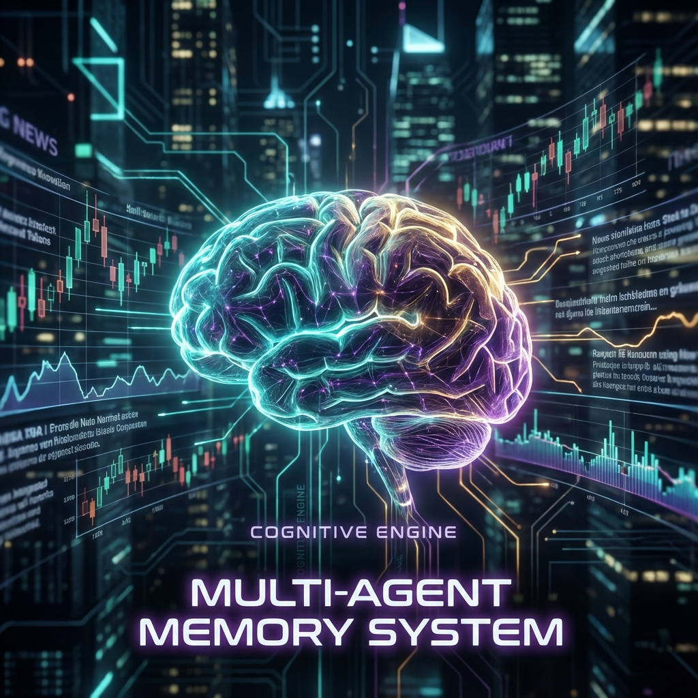
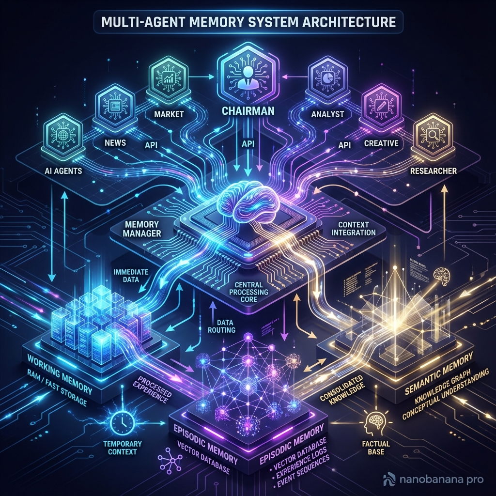

# Multi-Agent Memory System



Independently deployed cognitive engine enabling infinite memory retention and evolution for AI Agents.

[](https://www.python.org/downloads/)
[](https://www.trychroma.com/)
[](https://networkx.org/)

## 📋 Table of Contents

- [Overview](#-overview)
- [Architecture](#-architecture)
- [Automated Pipeline](#-automated-pipeline)
- [API Reference](#-api-reference)
- [Configuration](#-configuration)
- [Quick Start](#-quick-start)

---

## 🌟 Overview

The **Multi-Agent Memory System** is a standalone microservice designed to provide a shared, evolving memory brain for multiple AI Agents. Unlike traditional stateless agents or simple vector retrievers, this system implements a **human-like, three-tier memory architecture** that automatically condenses, extracts, and evolves information over time.

### Key Capabilities

- ✅ **Self-Driving Pipeline**: Automated promotion from Working -> Episodic -> Semantic memory.
- ✅ **Simplified Integration**: Agents just send "content"; the system handles storage logic.
- ✅ **Hybrid Intelligence**: Combines Vector Search (Similarity) with Knowledge Graphs (Relations).
- ✅ **Cognitive Evolution**: Automatically clusters episodic events to form high-level semantic principles.
- ✅ **Agent Isolation**: Secure, separate memory namespaces for different agents (e.g., `market_agent`, `news_agent`).

---

## 🏗️ Architecture



### Three-Tier Memory Model

| Tier | Storage | Capacity | Function |
|------|---------|----------|----------|
| **Working Memory** | RAM (Deque) | Small (e.g., 50 items) | **Short-term context**. Stores raw conversation logs. Automatically compresses when full. |
| **Episodic Memory** | Chroma (Vector) + NetworkX (Graph) | Large (Unlimited) | **Events & Facts**. Structured summaries and extracted entities (e.g., "AAPL earnings up"). |
| **Semantic Memory** | Chroma + SQLite | Abstract | **Principles & Knowledge**. High-level rules derived from clustering events (e.g., "User prefers verified data"). |

---

## 🔄 Automated Pipeline

The system manages memory lifecycle without Agent intervention:

1.  **Ingestion**: Logic accepts inputs into **Working Memory**.
2.  **Compression (Trigger: Overflow)**:
    *   When Working Memory exceeds token/item limits, older items are **Summarized**.
    *   **Event Extractor** (LLM) pulls structured entities/relations.
    *   Result: Stored as **Episodic Event**.
3.  **Clustering (Trigger: Accumulation)**:
    *   As Episodic Events grow, the system runs **K-Means Clustering**.
    *   Cluster centers are abstracted into **Core Principles**.
    *   Result: Stored as **Semantic Memory**.

---

## 📡 API Reference

### 1. Add Memory
**POST** `/memory/add`

Streamlined endpoint. The agent simply reports what happened.

```json
{
  "agent_id": "market_agent",
  "content": "Analyst report suggests AAPL is undervalued due to AI adoption.",
  "metadata": {
    "role": "user",
    "source": "bloomberg",
    "importance": 0.9
  }
}
```

*Note: You no longer need to specify `memory_type`. The system allows simplified input.*

### 2. Get Context
**POST** `/memory/context` (or GET)

Retrieve the full cognitive context for a new query.

```json
{
  "agent_id": "market_agent",
  "query": "Should I buy Apple stock?"
}
```

**Response**:
```json
{
  "status": "success",
  "context": {
    "core_principles": "User prefers aggressive growth...",
    "working_memory": [...],
    "episodic_memory": [...],
    "semantic_memory": [...]
  },
  "token_usage": {
    "total": 4500
  }
}
```

### 3. Get Stats
**GET** `/memory/stats?agent_id=market_agent`

View the current state of memory tiers.

---

## ⚙️ Configuration

The system is configured via `.config.yaml` in the root directory.

```yaml
# memory_system/.config.yaml

# 1. LLM Provider (for internal logic)
model: deepseek-ai/DeepSeek-V3.1-Terminus
api_url: https://api.siliconflow.cn/v1
api_keys:
  siliconflow: "sk-..."

# 2. Embedding Model (Local or API)
embedding_provider: huggingface
embedding_model: BAAI/bge-large-zh  # Supports 1024-dim high-quality embeddings
```

### Environment Variables
For docker or deployment overrides:
*   `HF_ENDPOINT`: Set to `https://hf-mirror.com` for China access.
*   `CHROMA_PERSIST_DIR`: Path to vector data.

---

## 🚀 Quick Start

### Installation

```bash
cd memory_system
pip install -r requirements.txt
```

### Running

```bash
# Verify system status
python verify_system.py

# Start API Server
python -m api.server
# Server running at http://0.0.0.0:10000
```

---

## 📝 TODO & Roadmap

### High Priority

- [ ] **Graph Retrieval Expansion** (图检索扩展相关实体)
  - Implement entity expansion in `episodic_memory.retrieve()`
  - Add `use_graph_expansion` parameter (default: False)
  - Extract entities from query using LLM or NER
  - Use `GraphStore.get_related_entities()` to expand search
  - Merge and re-rank results based on graph distance + semantic similarity
  - **Benefit**: Automatically retrieve memories related to connected entities (e.g., searching "Tesla" also returns "Elon Musk", "EV industry")

### Medium Priority

- [ ] Memory visualization in frontend (✅ Completed - see `frontendV2/`)
- [ ] Batch import/export functionality
- [ ] Memory analytics dashboard
- [ ] Multi-tenant memory isolation improvements

### Low Priority

- [ ] WebSocket real-time memory updates
- [ ] Memory garbage collection strategies
- [ ] Distributed memory system (Redis/Kafka)

---

**Last Updated**: 2025-12-07
