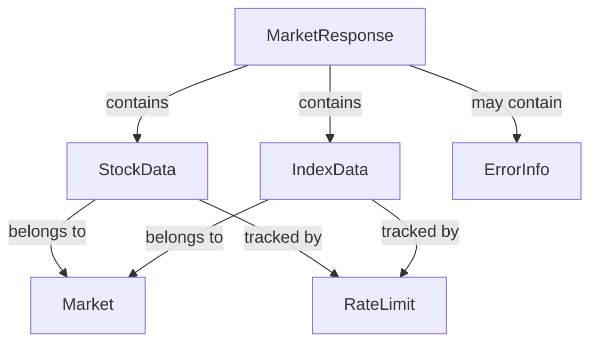

# Data Model: Market Data Tool

**Date**: 2025-11-09
**Purpose**: Define entities, attributes, and validation rules for market data tool

## Entity Definitions

### 1. Stock Data Entity (股票行情数据)

**Description**: Core stock market data including price, volume, and change information

**Fields**:
```python
class StockData:
    symbol: str                    # 股票代码 (000001, AAPL, 00700)
    name: str                      # 股票名称 (平安银行, Apple Inc., 腾讯控股)
    current_price: float           # 当前价格
    open_price: float             # 开盘价
    high_price: float             # 最高价
    low_price: float              # 最低价
    previous_close: float         # 昨收价
    change_amount: float          # 涨跌额 (当前价 - 昨收价)
    change_percent: float         # 涨跌幅百分比
    volume: int                   # 成交量 (股)
    turnover: float               # 成交额 (元)
    timestamp: datetime           # 数据时间戳
    market: str                   # 市场分类 (A-share, US, HK)
    currency: str                 # 货币 (CNY, USD, HKD)
    status: str                   # 交易状态 (trading, suspended, closed)
```

**Validation Rules**:
- `symbol`: Must match market-specific format
  - A-shares: 6-digit number (000001, 600000, 300001)
  - US stocks: 1-5 letters (AAPL, TSLA, MSFT)
  - HK stocks: 5-digit number (00700, 02318)
- `current_price`: Must be positive number > 0
- `change_percent`: Range -20% to +20% (typical daily limits)
- `volume`: Non-negative integer
- `timestamp`: Must be within 60 minutes of current time
- `market`: Must be one of ["A-share", "US", "HK"]
- `currency`: Must be one of ["CNY", "USD", "HKD"]

### 2. Index Data Entity (市场指数数据)

**Description**: Market index data for major indices

**Fields**:
```python
class IndexData:
    symbol: str                    # 指数代码 (^GSPC, ^HSI, 000001)
    name: str                      # 指数名称 (标普500, 恒生指数, 上证指数)
    current_value: float          # 当前点位
    open_value: float             # 开盘点位
    high_value: float             # 最高点位
    low_value: float              # 最低点位
    previous_close: float         # 昨收点位
    change_amount: float          # 涨跌点位
    change_percent: float         # 涨跌幅百分比
    timestamp: datetime           # 数据时间戳
    market: str                   # 关联市场
```

**Validation Rules**:
- `symbol`: Must match index format (^GSPC, ^HSI, or numeric)
- `current_value`: Must be positive number > 0
- `change_percent`: Range -10% to +10% (typical index daily limits)

### 3. Market Response Entity (市场响应数据)

**Description**: Standardized response format for market data requests

**Fields**:
```python
class MarketResponse:
    status: str                    # 响应状态 (success, error, partial)
    symbol: str                    # 请求的股票代码
    data: Dict[str, Any]          # 主要数据内容
    error_code: Optional[str]     # 错误代码 (可选)
    error_message: Optional[str]  # 错误消息 (可选)
    timestamp: datetime           # 响应时间戳
    data_source: str              # 数据源 (yahoo, sina, backup)
    cache_hit: bool              # 是否缓存命中
    response_time_ms: float      # 响应时间 (毫秒)
```

**Validation Rules**:
- `status`: Must be one of ["success", "error", "partial"]
- `data`: Must contain required fields based on data type
- `response_time_ms`: Must be positive number

### 4. Error Information Entity (错误信息)

**Description**: Structured error information for troubleshooting

**Fields**:
```python
class ErrorInfo:
    error_code: str               # 错误代码 (INVALID_SYMBOL, API_ERROR, RATE_LIMITED)
    error_message: str            # 错误消息 (中文)
    suggestion: str               # 用户建议
    context: Dict[str, Any]       # 错误上下文信息
    provider: str                 # 出错的提供商
    timestamp: datetime           # 错误时间戳
```

**Error Codes**:
- `INVALID_SYMBOL`: 股票代码格式错误
- `SYMBOL_NOT_FOUND`: 股票代码不存在
- `API_ERROR`: API接口错误
- `RATE_LIMITED`: 请求频率超限
- `SERVICE_UNAVAILABLE`: 服务不可用
- `TIMEOUT`: 请求超时
- `VALIDATION_ERROR`: 数据验证失败

### 5. Rate Limit Entity (限流信息)

**Description**: Rate limiting state for different markets

**Fields**:
```python
class RateLimit:
    market: str                   # 市场类型
    requests_per_hour: int        # 每小时最大请求数
    remaining_requests: int       # 剩余请求数
    window_start: datetime        # 时间窗口开始
    window_end: datetime          # 时间窗口结束
    reset_time: datetime          # 限制重置时间
```

**Rate Limits by Market**:
- A-shares: 120 requests/hour
- US stocks: 60 requests/hour
- HK stocks: 60 requests/hour

## Entity Relationships



## Data Validation Functions

### Stock Symbol Validation
```python
def validate_stock_symbol(symbol: str, market: str) -> bool:
    """Validate stock symbol format by market"""
    if market == "A-share":
        # 6-digit number starting with 000, 002, 300, 600, 601, 603
        import re
        return bool(re.match(r'^(000|002|300|600|601|603)\d{3}$', symbol))
    elif market == "US":
        # 1-5 letters
        import re
        return bool(re.match(r'^[A-Z]{1,5}$', symbol.upper()))
    elif market == "HK":
        # 5-digit number starting with 00000-09999
        import re
        return bool(re.match(r'^0\d{4}$', symbol))
    return False
```

### Price Data Validation
```python
def validate_price_data(data: Dict) -> List[str]:
    """Validate price data integrity"""
    errors = []

    # Check price consistency
    if data['current_price'] <= 0:
        errors.append("当前价格必须大于0")

    if data['high_price'] < data['low_price']:
        errors.append("最高价不能低于最低价")

    if not (data['low_price'] <= data['current_price'] <= data['high_price']):
        errors.append("当前价格必须在最高价和最低价之间")

    # Check change calculation
    expected_change = data['current_price'] - data['previous_close']
    if abs(expected_change - data['change_amount']) > 0.01:
        errors.append("涨跌额计算错误")

    expected_change_percent = (expected_change / data['previous_close']) * 100
    if abs(expected_change_percent - data['change_percent']) > 0.1:
        errors.append("涨跌幅计算错误")

    return errors
```

### Market Hours Validation
```python
def validate_market_hours(market: str, timestamp: datetime) -> bool:
    """Check if timestamp is within market hours"""
    if market == "A-share":
        # A-shares: 9:30-11:30, 13:00-15:00 (Beijing time)
        hour = timestamp.hour
        minute = timestamp.minute
        morning_session = (9 <= hour < 11) or (hour == 11 and minute <= 30)
        afternoon_session = (13 <= hour < 15)
        return morning_session or afternoon_session
    elif market == "US":
        # US stocks: 9:30-16:00 (Eastern time)
        hour = timestamp.hour
        minute = timestamp.minute
        return (9 <= hour < 16) or (hour == 9 and minute >= 30)
    elif market == "HK":
        # HK stocks: 9:30-12:00, 13:00-16:00 (Hong Kong time)
        hour = timestamp.hour
        minute = timestamp.minute
        morning_session = (9 <= hour < 12) or (hour == 9 and minute >= 30)
        afternoon_session = (13 <= hour < 16)
        return morning_session or afternoon_session
    return True  # Assume valid if market type unknown
```

## API Contract Specifications

### Request Format
```python
# Single stock request
{
    "action": "get_quote",
    "symbol": "000001",
    "market": "A-share"
}

# Batch request
{
    "action": "get_quotes",
    "symbols": ["000001", "AAPL", "00700"],
    "include_indices": true
}
```

### Response Format
```python
# Success response
{
    "status": "success",
    "symbol": "000001",
    "data": {
        "symbol": "000001",
        "name": "平安银行",
        "current_price": 12.45,
        "change_percent": 2.35,
        "volume": 1234567,
        "timestamp": "2025-11-09 15:30:00",
        "market": "A-share"
    },
    "timestamp": "2025-11-09 15:30:05",
    "data_source": "yahoo",
    "response_time_ms": 1234
}

# Error response
{
    "status": "error",
    "symbol": "999999",
    "error_code": "SYMBOL_NOT_FOUND",
    "error_message": "股票代码 999999 不存在，请检查输入",
    "suggestion": "请输入正确的6位数字股票代码",
    "timestamp": "2025-11-09 15:30:05"
}
```

## Data Mapping by Market

### A-Share Data Fields
- 股票代码: symbol (000001)
- 股票名称: name from API (平安银行)
- 当前价: current_price (12.45)
- 昨收价: previous_close (12.16)
- 开盘价: open_price (12.20)
- 最高价: high_price (12.50)
- 最低价: low_price (12.15)
- 成交量: volume (1234567股)
- 成交额: turnover (计算得出)
- 涨跌额: change_amount (0.29)
- 涨跌幅: change_percent (2.35%)

### US Stock Data Fields
- Same field mapping, different currency (USD)
- Extended hours data where available
- Market cap and company info included

### HK Stock Data Fields
- Same field mapping, different currency (HKD)
- Lot size information where relevant

This data model provides a comprehensive, validated structure for market data across all three markets while maintaining consistency and supporting Chinese-first user experience.